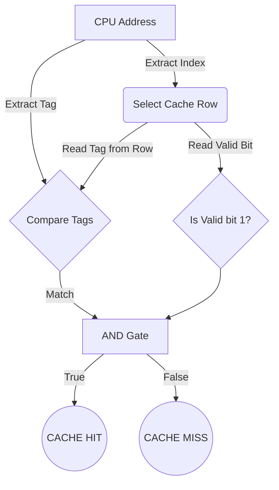

---
tags:
  - computer-architecture
  - memory-hierarchy
  - cache
  - locality
  - direct-mapped
aliases:
  - Memory Hierarchy and Caches
  - CSE 4305 Lecture 6
date: 2023-10-25
---

## 🧠 Introduction: The Memory Dilemma
In computer architecture, one of the "8 Great Ideas" is the **Hierarchy of Memories**. 
Programmers typically want memory to be:
1. **Unlimited** in capacity.
2. **Infinitely Fast**.

However, physics and economics dictate that **fast memory technology is significantly more expensive per bit than slower memory**. 

**The Solution:** Organize the memory system into a hierarchy.
* Store *all* data in large, cheap, slow memory.
* Keep *recently and frequently used* data in small, expensive, fast memory closer to the CPU.

---

## 🔁 The Principle of Locality
Memory hierarchies work exceptionally well because programs do not access all code or data randomly. They exhibit **Locality of Reference**. 

There are two primary types of locality:

### 1. Temporal Locality (Locality in Time)
* **Definition:** If an item is accessed, it is highly likely to be accessed again soon.
* **Program Example:** Instructions inside a `for` or `while` loop. The processor executes the same block of instructions repeatedly.
* **Data Example:** Induction variables (like `i` in a loop) or accumulators (like `sum += a[i]`).
* **Cache Advantage:** Once read from main memory, a copy is kept in the cache. Subsequent reads are much faster.

### 2. Spatial Locality (Locality in Space)
* **Definition:** If an item is accessed, items whose addresses are close by are likely to be accessed soon.
* **Program Example:** Instructions are generally executed sequentially (`i`, then `i+1`, then `i+2`).
* **Data Example:** Arrays. Elements are stored contiguously in memory. Accessing `a[0]` usually implies `a[1]` will be accessed next.
* **Cache Advantage:** Instead of fetching a single byte, the cache fetches a **Block** (several bytes/words) at once. 
	* *Note on Penalty:* This initial bulk load incurs a slight **performance penalty** upfront, but it pays off as subsequent nearby data is already in the fast cache.

> [!example] The Library Analogy 📚
> - **The Library (Main Memory/Disk):** Holds all possible information. Going here is slow (Slowest).
> - **Your Bookshelf (DRAM/Main Memory):** Holds a smaller subset of books you checked out. Faster to access than the library.
> - **Your Desk (Cache):** Holds the specific books you are reading *right now*. Access is immediate (Fastest, Smallest).
> - **You (The CPU):** Processing the information.
> 
> *Temporal Locality:* You keep re-reading the same book on your desk.
> *Spatial Locality:* You check out books on the same shelf because they cover similar topics.

---

## 💾 Memory Technologies (Supplemented)
The PDF references Chapter 5.2 for underlying technologies. Here is the necessary context:

| Technology | Location | Speed | Size | Cost/Bit | How it works |
| :--- | :--- | :--- | :--- | :--- | :--- |
| **SRAM** (Static RAM) | L1/L2/L3 Caches | **Fastest** | Smallest | Highest | Uses 6 transistors per bit. Does not need to be "refreshed". Retains data as long as power is on. |
| **DRAM** (Dynamic RAM) | Main Memory (RAM) | Slower | Larger | Moderate | Uses 1 transistor and 1 capacitor per bit. Capacitors leak charge, so it must be periodically **refreshed**. |
| **Flash/SSD** | Secondary Storage | Very Slow | Huge | Low | Non-volatile memory (keeps data without power). Uses floating-gate transistors. |
| **Magnetic Disk** | Hard Drives (HDD) | **Slowest** | Biggest | Lowest | Mechanical platters and read/write heads. Extremely slow compared to silicon memory. |

---

## 📐 Memory Hierarchy Terminology & Metrics

Data is only copied between *two adjacent levels* of the hierarchy at a time. The "Upper level" is the one closer to the processor.

* **Block (or Line):** The minimum unit of information copied between levels (e.g., moving a whole "book" to the desk, not just a page).
* **Hit:** The requested data is found in the upper level.
* **Miss:** The requested data is *not* found in the upper level. The CPU must halt and wait for the lower level to retrieve it.
* **Hit Rate / Hit Ratio:** `Hits / Total Accesses`. Used to measure cache performance.
* **Miss Rate:** `Misses / Total Accesses` (or `1 - Hit Rate`).
* **Hit Time:** The time it takes to access the cache, including the time to determine if it's a hit or miss.
* **Miss Penalty:** The time it takes to fetch a block from the lower level + time to replace the old block in the upper level + time to deliver it to the CPU.

> [!formula] Average Memory Access Time (AMAT)
> While not strictly in the slides, this is the foundational formula of memory performance:
> $$AMAT = Hit\_Time + (Miss\_Rate \times Miss\_Penalty)$$

---

## ⚙️ Direct-Mapped Cache Design

A cache is divided into **blocks** (usually a power of 2). 
In a **Direct-Mapped Cache**, each location in main memory maps to *exactly one* specific block in the cache. 

### 1. Finding the Cache Index (The Modulo Trick)
To determine where a memory address belongs in the cache, we use modulo arithmetic:
$$Cache\_Index = Memory\_Address \pmod{Number\_of\_Blocks\_in\_Cache}$$

**Binary Shortcut:** If the cache has $2^k$ blocks, the cache index is simply the **lowest $k$ bits** of the memory address.
* *Example:* Cache has 4 blocks ($2^2$). Address 14 in binary is `1110`. The lowest 2 bits are `10` (which is 2). So, address 14 maps to cache block 2.

### 2. Distinguishing Data (Adding Tags)
Since multiple memory addresses map to the exact same cache block (e.g., addresses 2, 6, 10, and 14 all map to block 2), the cache needs a way to know *which* address is currently occupying the block.
* **Tag:** We store the *upper bits* of the memory address alongside the data in the cache. 
* To check for a hit, the CPU compares the Tag of the requested address with the Tag stored in the cache block.

### 3. The Valid Bit
When a computer boots up, the cache contains random "garbage" data. 
* **Valid Bit (V):** A single bit added to each cache row. 
* It is initialized to `0` (Invalid). 
* When real data is loaded into the block from main memory, the valid bit is set to `1`. 
* **A cache hit only occurs if the Tags match AND the Valid bit is 1.**

> [!summary] Anatomy of a Cache Request
> When the CPU asks for a 32-bit memory address, the hardware splits the address into pieces:
> ```mermaid
> classDiagram
>   class 32Bit_Address {
>     +Tag (Upper bits)
>     +Index (Middle bits)
>     +Offset (Lower bits - inside the block)
>   }
> ```

### Hardware Implementation of a Cache Hit


---

## 📝 Step-by-Step Direct-Mapped Cache Example

**The Setup:**
* **Cache Size:** 8 Blocks ($2^3 \rightarrow$ 3 bits needed for Index).
* **Block Size:** 1 Word per block (No offset bits needed for this example).
* **Address Size:** 5 bits total (given in the slide example).
* Therefore, Address structure: `[ 2 bit TAG | 3 bit INDEX ]`.

**Scenario Execution (Slide 33-42):**
We process a series of memory addresses: `22, 26, 22, 26, 16, 3, 16, 18, 16`.

| CPU Request | Binary | Index (Last 3) | Tag (First 2) | Hit/Miss | Action Taken |
| :--- | :--- | :--- | :--- | :--- | :--- |
| **22** | `10110` | `110` | `10` | **Miss** | Cache block `110` is empty. Load Mem[22]. Valid bit = 1. Tag = `10`. |
| **26** | `11010` | `010` | `11` | **Miss** | Cache block `010` is empty. Load Mem[26]. Valid bit = 1. Tag = `11`. |
| **22** | `10110` | `110` | `10` | **HIT** | Block `110` is Valid. Stored Tag `10` matches request Tag `10`. |
| **26** | `11010` | `010` | `11` | **HIT** | Block `010` is Valid. Stored Tag `11` matches request Tag `11`. |
| **16** | `10000` | `000` | `10` | **Miss** | Cache block `000` is empty. Load Mem[16]. |
| **3** | `00011` | `011` | `00` | **Miss** | Cache block `011` is empty. Load Mem[3]. |
| **16** | `10000` | `000` | `10` | **HIT** | Data was placed here in step 5. |
| **18** | `10010` | `010` | `10` | **Miss (Eviction)** | Index `010` contains Tag `11` (from addr 26). Tags don't match! Overwrite block `010` with Mem[18]. Update Tag to `10`. |
| **16** | `10000` | `000` | `10` | **HIT** | Still securely in the cache. |

### Final Cache State
Based on the operations above:

| Index | Valid (V) | Tag | Data |
| :--- | :--- | :--- | :--- |
| **000** | 1 | 10 | Mem[10000] *(Addr 16)* |
| **001** | 0 | | |
| **010** | 1 | 10 | Mem[10010] *(Addr 18 - Evicted Addr 26)* |
| **011** | 1 | 00 | Mem[00011] *(Addr 3)* |
| **100** | 0 | | |
| **101** | 0 | | |
| **110** | 1 | 10 | Mem[10110] *(Addr 22)* |
| **111** | 0 | | |

### What happens when the Cache is Full?
As seen with address 18 above, if the cache runs out of space, or multiple addresses map to the exact same block, the hardware uses a **replacement policy**. 
In a direct-mapped cache, there is no choice: the new block *automatically overwrites* whatever previously stored data is in that specific index. This is inherently a form of Least Recently Used (LRU) assuming the older data is less likely to be needed right now.
