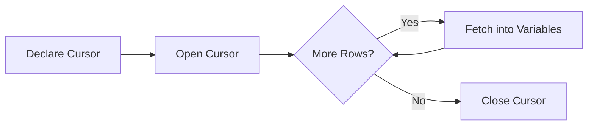

**Tags:** #database #sql #jdbc #python #plpgsql #triggers #olap #recursive-queries
**Context:** CSE 4307: Database Management Systems (Chapter 5)

---

## 1. Accessing SQL from Programming Languages

SQL is a powerful data manipulation language, but it is not a general-purpose programming language. It lacks UI capabilities and complex application logic. Therefore, real-world applications (Web Servers, GUIs) use "Host Languages" (Java, Python, C++, etc.) to handle logic while delegating data tasks to the DBMS.

### Approaches to Database Connectivity

There are two primary paradigms for connecting applications to databases:

1.  **Dynamic SQL:** Queries are constructed as strings at runtime and sent to the database via an API.
    *   *Examples:* **JDBC** (Java), **ODBC** (C/C++), Python DB-API.
    *   *Pros:* Flexible, standard library support.
    *   *Cons:* Syntax errors caught at runtime, higher risk of SQL Injection if not handled correctly.
2.  **Embedded SQL:** SQL statements are written directly inside the host language source code, prefixed with a special marker (e.g., `EXEC SQL`).
    *   *Mechanism:* A preprocessor converts SQL into host language API calls *before* compilation.
    *   *Pros:* Static checking (syntax errors caught at compile time).
    *   *Cons:* Requires a specialized pre-compiler, less portable across languages.

---

## 2. Java Database Connectivity (JDBC)

JDBC is the industry-standard Java API for connecting to relational databases. It allows Java applications to execute SQL statements, retrieve results, and handle errors.

### 2.1 The JDBC Architecture Model
The communication flow follows these steps:
1.  **Open Connection:** Connect to the specific DB using a URL.
2.  **Create Statement:** An object used to carry the SQL query.
3.  **Execute Query:** Send SQL to the DB and fetch the `ResultSet`.
4.  **Exception Handling:** Manage `SQLException`.

### 2.2 Establishing Connections
Modern JDBC (Java 7+ / JDBC 4.0+) uses `try-with-resources` to ensure connections close automatically.

```java
// Connection String Format: jdbc:driver:protocol:@host:port:database
String url = "jdbc:oracle:thin:@db.yale.edu:2000:univdb";

try (Connection conn = DriverManager.getConnection(url, "user", "pass");
     Statement stmt = conn.createStatement()) {
    
    // Perform DB operations here
    
} catch (SQLException e) {
    e.printStackTrace();
}
// Resources (conn, stmt) are automatically closed here
```

> [!INFO] **Legacy Approach**
> Older JDBC code required `Class.forName("driver")` to load drivers and explicit `.close()` calls in a `finally` block. This was error-prone and is no longer recommended.

### 2.3 Executing Commands

| Operation | Method | Return Type | Usage |
| :--- | :--- | :--- | :--- |
| **Query** | `stmt.executeQuery(sql)` | `ResultSet` | For `SELECT` statements. |
| **Update** | `stmt.executeUpdate(sql)` | `int` | For `INSERT`, `UPDATE`, `DELETE`. Returns row count affected. |

**Fetching Results:**
```java
ResultSet rs = stmt.executeQuery("SELECT dept_name, budget FROM department");
while (rs.next()) {
    // Retrieve by column name or index (1-based)
    String name = rs.getString("dept_name");
    float budget = rs.getFloat(2);
    
    // Check for NULL values in primitive types
    if (rs.wasNull()) { 
        System.out.println("Budget is null"); 
    }
}
```

### 2.4 SQL Injection & Prepared Statements

**The Vulnerability:**
Constructing queries by concatenating strings allows attackers to manipulate the SQL logic.
*   *Bad Code:* `"SELECT * FROM users WHERE name = '" + userName + "'"`
*   *Input:* `' OR '1'='1`
*   *Result:* `SELECT * FROM users WHERE name = '' OR '1'='1'` (Returns all users).

**The Solution: Prepared Statements**
Precompiled SQL queries where user input is treated as literal data, never executable code.

> [!check] **Best Practice**
> Always use `PreparedStatement` for any query involving user input.

```java
// ? acts as a placeholder
String sql = "INSERT INTO instructor VALUES(?, ?, ?, ?)";
PreparedStatement pStmt = conn.prepareStatement(sql);

// Bind values (Indices are 1-based)
pStmt.setString(1, "88877");
pStmt.setString(2, "Perry");
pStmt.setString(3, "Finance");
pStmt.setInt(4, 125000);

pStmt.executeUpdate(); // Execute without passing the SQL string again
```

### 2.5 Metadata
JDBC allows introspection of the database schema (useful for generic tools like IDEs).
1.  **ResultSetMetaData:** Information about the *returned data* (column names, types).
2.  **DatabaseMetaData:** Information about the *whole database* (tables, primary keys, driver info).

### 2.6 Transactions in JDBC
By default, JDBC is in **Auto-Commit** mode (every statement is a transaction).
To group operations atomically:
```java
conn.setAutoCommit(false); // Start Transaction

try {
    stmt.executeUpdate("UPDATE account SET bal = bal - 100 WHERE id = 1");
    stmt.executeUpdate("UPDATE account SET bal = bal + 100 WHERE id = 2");
    conn.commit(); // Commit if successful
} catch (SQLException e) {
    conn.rollback(); // Undo if error occurs
}
```

---

## 3. Python Database Access (DB-API)

Python uses a standard specification (PEP 249 - DB-API 2.0). Most drivers (`psycopg2`, `sqlite3`, `mysql-connector`) follow this pattern.

**Workflow:**
1.  **Connection:** Represents the session.
2.  **Cursor:** Object to execute queries and iterate results.

```python
import sqlite3

# 1. Connect
conn = sqlite3.connect('univ.db')
cursor = conn.cursor()

# 2. Execute with Safe Parameterization
# Note: Syntax varies by driver ('?' for sqlite, '%s' for postgres)
dept_name = 'Music'
cursor.execute("SELECT name FROM instructor WHERE dept_name = ?", (dept_name,))

# 3. Fetch
for row in cursor.fetchall():
    print(row[0]) # Access by index

conn.close()
```

---

## 4. Embedded SQL

Used in C/C++/COBOL/Fortran. It bridges the **Impedance Mismatch**:
*   *SQL* works on **Sets** (tables).
*   *Host Languages* work on **Records/Variables**.

### 4.1 Concepts
*   **Preprocessor:** Converts `EXEC SQL` commands into native API calls.
*   **Host Variables:** Declared in a `DECLARE SECTION` and prefixed with `:` in SQL to bind data.
*   **SQLSTATE:** A variable that holds status codes (e.g., '02000' means "No more data").

### 4.2 Cursors
A mechanism to process a set of rows one by one.



**Syntax Example (C-style pseudocode):**
```c
EXEC SQL DECLARE c CURSOR FOR 
    SELECT ID, name FROM student WHERE tot_cred > :min_credit;

EXEC SQL OPEN c;

while (1) {
    EXEC SQL FETCH c INTO :si, :sn;
    if (SQLSTATE == '02000') break; // Exit on no data
    printf("%s", sn);
}

EXEC SQL CLOSE c;
```

**Updating via Cursor:**
To update the specific row the cursor is currently pointing to:
```sql
UPDATE instructor SET salary = salary + 1000 WHERE CURRENT OF c;
```

---

## 5. PL/pgSQL (Procedural Language for PostgreSQL)

PL/pgSQL allows writing complex business logic (conditions, loops) stored directly inside the database. This reduces network traffic between the app and DB.

### 5.1 Block Structure
The basic unit is a block, often defined using "Dollar Quoting" (`$$`) to avoid escaping single quotes.

```sql
DO $$ 
DECLARE
    counter integer := 0;
BEGIN
    counter := counter + 1;
    RAISE NOTICE 'Counter is %', counter;
END $$;
```

### 5.2 Functions vs. Procedures (PostgreSQL 11+)

| Feature | Function | Procedure |
| :--- | :--- | :--- |
| **Invocation** | `SELECT func_name();` | `CALL proc_name();` |
| **Return** | Must return value (or void). | No return value (uses `INOUT` params). |
| **Transactions** | **Cannot** manage transactions. | **Can** use `COMMIT` / `ROLLBACK`. |

**Function Example (Returns Table):**
```sql
CREATE FUNCTION get_instructors(d_name varchar) 
RETURNS TABLE (id varchar, name varchar) AS $$
BEGIN
    RETURN QUERY 
    SELECT i.id, i.name FROM instructor i WHERE i.dept_name = d_name;
END;
$$ LANGUAGE plpgsql;
```

**Procedure Example (With Transaction):**
```sql
CREATE PROCEDURE safe_update() LANGUAGE plpgsql AS $$
BEGIN
    UPDATE accounts SET bal = bal * 1.05;
    COMMIT; -- Saves progress immediately
    UPDATE log SET status = 'Done';
END;
$$;
```

### 5.3 Control Structures
*   **Conditional:** `IF ... THEN ... ELSIF ... ELSE ... END IF;`
*   **Loops:** `FOR record IN SELECT ... LOOP ... END LOOP;`
*   **Assignments:** `SELECT count(*) INTO variable FROM ...`

---

## 6. Triggers

Triggers are procedural code blocks that automatically "fire" in response to DB events (`INSERT`, `UPDATE`, `DELETE`).

### 6.1 The ECA Model
*   **Event:** What happened? (e.g., `AFTER UPDATE ON grade`).
*   **Condition:** Should the trigger run? (e.g., `WHEN NEW.grade IS NOT NULL`).
*   **Action:** The logic to execute.

### 6.2 Implementation in PostgreSQL
Postgres requires two steps: 
1. Define a **Function** that returns `TRIGGER`.
2. Bind it to a table using `CREATE TRIGGER`.

**Transition Variables:**
*   `OLD`: The row *before* the update/delete.
*   `NEW`: The row *after* the update/insert.

### 6.3 Row-Level vs. Statement-Level

| Feature | Row-Level (`FOR EACH ROW`) | Statement-Level (`FOR EACH STATEMENT`) |
| :--- | :--- | :--- |
| **Frequency** | Fires once per **tuple** modified. | Fires once per **SQL command**. |
| **Data Access** | Can access `OLD` and `NEW` row data. | Uses "Transition Tables" (batches). |
| **Use Case** | Data validation, calculation, audit log per row. | Logging batch jobs, checking table-wide constraints. |

**Example: Auto-Calculate Credits**
```sql
CREATE FUNCTION add_credits() RETURNS TRIGGER AS $$
BEGIN
    IF NEW.grade <> 'F' AND NEW.grade IS NOT NULL THEN
        UPDATE student 
        SET tot_cred = tot_cred + (SELECT credits FROM course WHERE id = NEW.course_id)
        WHERE id = NEW.student_id;
    END IF;
    RETURN NEW;
END;
$$ LANGUAGE plpgsql;

CREATE TRIGGER on_grade_update
AFTER UPDATE OF grade ON takes
FOR EACH ROW
EXECUTE FUNCTION add_credits();
```

> [!WARNING] **Risks of Triggers**
> *   **Cascading:** Trigger A updates Table B, which has Trigger B updating Table A (Infinite Loop).
> *   **Performance:** Trigger overhead can stall bulk loads (e.g., updating 1 million rows fires the function 1 million times).

---

## 7. Recursive Queries

Standard SQL cannot query hierarchies of unknown depth (e.g., "Find all prerequisites of prerequisites..."). SQL:1999 introduced **Common Table Expressions (CTEs)** with `WITH RECURSIVE`.

### 7.1 Structure of Recursion
1.  **Base Case:** The starting point (Non-recursive).
2.  **Union:** Combines results.
3.  **Recursive Step:** Joins the CTE with the original table to find the next level.
4.  **Termination:** Stops when the recursive step returns no new rows (Fixed Point).

**Example: Course Prerequisites**
```sql
WITH RECURSIVE rec_prereq(course_id, prereq_id) AS (
    -- 1. Base Case: Direct prerequisites
    SELECT course_id, prereq_id FROM prereq
    
    UNION
    
    -- 2. Recursive Step: Join CTE (rec_prereq) with table (prereq)
    SELECT rec.course_id, p.prereq_id
    FROM rec_prereq rec, prereq p
    WHERE rec.prereq_id = p.course_id
)
SELECT * FROM rec_prereq;
```

---

## 8. Advanced Aggregation & OLAP

Online Analytical Processing (OLAP) involves viewing data across multiple dimensions (Multidimensional Data Cube).

### 8.1 Ranking Functions
Unlike standard aggregation, ranking assigns a value to each row based on order.

*   `rank()`: Skips numbers for ties (1, 1, 3).
*   `dense_rank()`: No gaps (1, 1, 2).
*   `row_number()`: Unique sequential number (1, 2, 3).
*   `ntile(n)`: Divides data into $n$ buckets (e.g., Quartiles).

```sql
SELECT ID, rank() OVER (ORDER BY GPA DESC) as s_rank 
FROM student_grades;
```

### 8.2 Window Functions
Perform calculations across a set of table rows that are related to the current row. Unlike `GROUP BY`, **window functions do not collapse rows**.

**Syntax:**
`function() OVER (PARTITION BY ... ORDER BY ... ROWS BETWEEN ...)`

**Example: Moving Average**
```sql
SELECT date, val,
       AVG(val) OVER (ORDER BY date ROWS BETWEEN 1 PRECEDING AND 1 FOLLOWING) 
FROM sales;
```
*Logic:* Averages (Yesterday + Today + Tomorrow) / 3.

**Example: Running Total**
```sql
SELECT acct, amount, 
       SUM(amount) OVER (PARTITION BY acct ORDER BY date ROWS UNBOUNDED PRECEDING)
FROM transactions;
```
*Logic:* Resets the sum for every new Account ID.

### 8.3 OLAP Cubes (Rollup & Cube)

Standard `GROUP BY` produces a 2D table. OLAP extensions generate subtotals automatically.

1.  **ROLLUP(Item, Color):**
    *   Generates groupings for: (Item, Color), (Item), and ().
    *   Good for hierarchical data (Year -> Month -> Day).
2.  **CUBE(Item, Color):**
    *   Generates **all** possible combinations ($2^N$).
    *   Groupings: (Item, Color), (Item), (Color), ().
    *   Allows "Slicing" and "Dicing" by any dimension.

| Concept | Definition |
| :--- | :--- |
| **Slicing** | Fix one dimension (e.g., Color='Red') to view a 2D slice. |
| **Dicing** | Select a sub-cube (e.g., 'Red' shirts or 'Blue' pants). |
| **Roll-up** | Zoom out / Summarize (Day $\to$ Month). |
| **Drill-down** | Zoom in / Detail (Month $\to$ Day). |