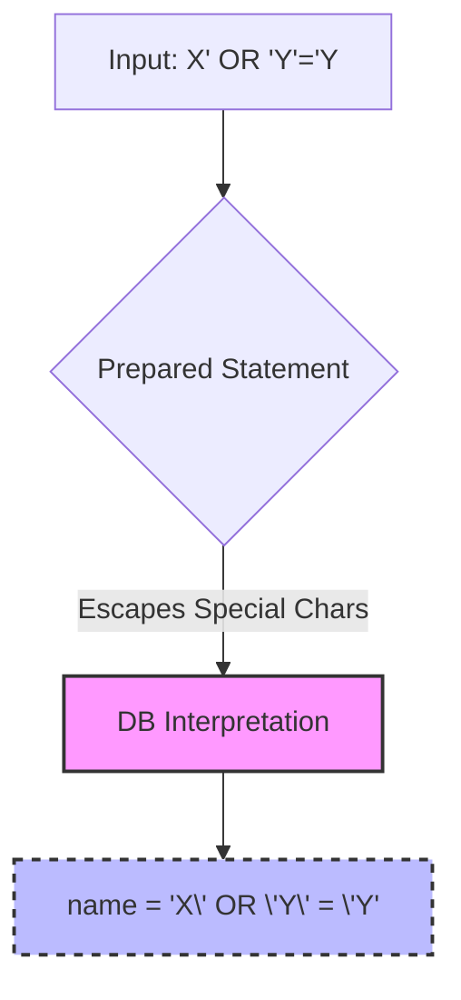
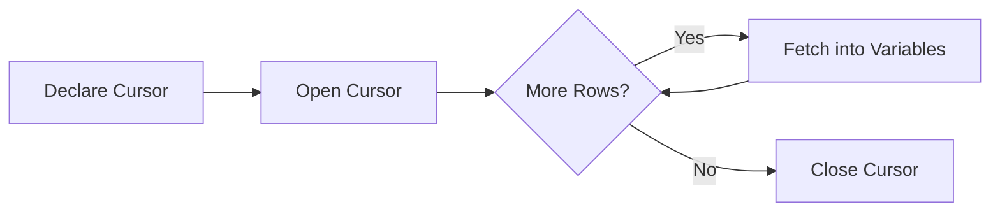
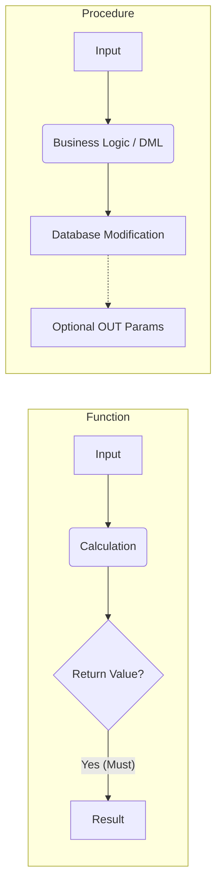

**Tags:** #database #sql #jdbc #python #plpgsql #triggers #olap #recursive-queries
**Context:** CSE 4307: Database Management Systems (Chapter 5)
**Read this instead of Slide?**: Not Recommended 
						- Extra Details might not be needed for exams 

---

## 1. Accessing SQL from Programming Languages

SQL is a powerful data manipulation language, but it is not a general-purpose programming language. It lacks UI capabilities and complex application logic. Therefore, real-world applications (Web Servers, GUIs) use "Host Languages" (Java, Python, C++, etc.) to handle logic while delegating data tasks to the DBMS.

### Approaches to Database Connectivity

There are two primary paradigms for connecting applications to databases:

1.  **Dynamic SQL:** Queries are constructed as strings at runtime and sent to the database via an API.
    *   *Examples:* **JDBC** (Java), **ODBC** (C/C++), Python DB-API.
    *   *Pros:* Flexible, standard library support.
    *   *Cons:* Syntax errors caught at runtime, higher risk of SQL Injection if not handled correctly.
2.  **Embedded SQL:** SQL statements are written directly inside the host language source code, prefixed with a special marker (e.g., `EXEC SQL`).
    *   *Mechanism:* A preprocessor converts SQL into host language API calls *before* compilation.
    *   *Pros:* Static checking (syntax errors caught at compile time).
    *   *Cons:* Requires a specialized pre-compiler, less portable across languages.

---

## 2. ODBC vs. JDBC vs. Embedded SQL

### 2.1 Comparison Summary

| Feature | ODBC | JDBC | Embedded SQL |
| :--- | :--- | :--- | :--- |
| **Language** | C API (C++, C#, etc.) | Strictly Java | Varies (C, C++, etc.) |
| **Portability** | Relies on OS-specific drivers (DLLs/.so) | Platform independent (JVM) | Dependent on pre-compiler |
| **Architecture** | Call-Level Interface (CLI) | Call-Level Interface (CLI) | Mixed with source code |
| **Compilation** | Standard runtime library | Standard Java compilation | Requires a Special Pre-compiler |

### 2.2 Key Comparisons

#### 1. ODBC vs. JDBC (The "Platform" Battle)
*   **ODBC** is like a "native" translator. It's fast, but because it uses system files (like `.dll` on Windows), it isn't easily moved from one type of computer to another without changing the drivers.
*   **JDBC** is built for the "Write Once, Run Anywhere" philosophy of Java. As long as you have a JVM, your database connection code remains the same.

#### 2. ODBC vs. Embedded SQL (The "Mechanism" Battle)
*   **Embedded SQL** is "baked in." You write SQL commands directly into your code (e.g., `EXEC SQL SELECT...`), and a pre-compiler transforms those lines into something the computer understands before the final compilation.
*   **ODBC** is "on-demand." It's just a library of functions your code calls while the program is actually running. No special pre-processing is needed.

> [!TIP] **Usage Note**
> ODBC is generally preferred when you need high performance across different languages like C++ or Python, whereas JDBC is the gold standard for anything in the Java ecosystem.

---

## 3. Java Database Connectivity (JDBC)

JDBC is the industry-standard Java API for connecting to relational databases. It allows Java applications to execute SQL statements, retrieve results, and handle errors.

### 3.1 The JDBC Architecture Model
The communication flow follows these steps:
1.  **Open Connection:** Connect to the specific DB using a URL.
2.  **Create Statement:** An object used to carry the SQL query.
3.  **Execute Query:** Send SQL to the DB and fetch the `ResultSet`.
4.  **Exception Handling:** Manage `SQLException`.

### 3.2 Establishing Connections
Modern JDBC (Java 7+ / JDBC 4.0+) uses `try-with-resources` to ensure connections close automatically. 
```java
try(){}
catch(){}
```

```java
// Connection String Format: jdbc:driver:protocol:@host:port:database
String url = "jdbc:oracle:thin:@db.yale.edu:2000:univdb";

try (Connection conn = DriverManager.getConnection(url, "user", "pass");
     Statement stmt = conn.createStatement()) {
    
    // Perform DB operations here
    
} catch (SQLException e) {
    e.printStackTrace();
}
// Resources (conn, stmt) are automatically closed here
```

> [!INFO] **Legacy Approach**
> Older JDBC code required `Class.forName("driver")` to load drivers and explicit `.close()` calls in a `finally` block. This was error-prone and is no longer recommended.

### 3.3 Executing Commands

| Operation | Method | Return Type | Usage |
| :--- | :--- | :--- | :--- |
| **Query** | `stmt.executeQuery(sql)` | `ResultSet` | For `SELECT` statements. |
| **Update** | `stmt.executeUpdate(sql)` | `int` | For `INSERT`, `UPDATE`, `DELETE`. Returns row count affected. |

**Fetching Results:**
```java
ResultSet rs = stmt.executeQuery("SELECT dept_name, budget FROM department");
while (rs.next()) {
    // Retrieve by column name or index (1-based)
    String name = rs.getString("dept_name");
    float budget = rs.getFloat(2);
    
    // Check for NULL values in primitive types
    if (rs.wasNull()) { 
        System.out.println("Budget is null"); 
    }
}
```

### 3.4 SQL Injection & Prepared Statements

#### 🧠 The Concept
**Prepared Statements** act as a barrier between user input and the database engine. They specifically neutralize **"Piggybacked" queries**, where an attacker attempts to append a second, malicious command to a standard lookup.

---

#### 🛑 The Attack Scenario
**The Goal:** The attacker wants to execute a malicious UPDATE command along with the standard SELECT command.

**1. The Malicious Input:**
An attacker enters the following string into a "Name" text field:
`X'; update instructor set salary = salary + 10000; --`

**2. The Vulnerability (String Concatenation):**
If the application constructs the query using simple string concatenation (e.g., `"WHERE name = '" + userInput + "'"`), the database receives this:

```sql
SELECT * FROM instructor WHERE name = 'X'; update instructor set salary = salary + 10000; --'
```

##### 📉 Visualizing the Breakdown
Here is how the Database Engine interprets that concatenated string:

| Component | Code Segment | Action |
| :--- | :--- | :--- |
| **1. Original Query** | `SELECT ... name = 'X';` | Finishes the intended query legitimately. |
| **2. Injection** | `update instructor ...` | **Executes a totally new, unauthorized command.** |
| **3. Cleanup** | `--` | Comments out the closing quote (`'`) to prevent syntax errors. |

---

#### ✅ The Solution: Prepared Statements
Instead of merging data into the query string *before* sending it to the database, Prepared Statements send the **Query Structure** and the **Data** separately.

##### 🛠️ How it works Internally (The "Escaped" Line)
When you use a Prepared Statement, the database driver treats the input strictly as data, not executable code.

> [!EXAMPLE] Visualizing the Escape
> If the attacker tries the input `X' or 'Y'='Y`, the database interprets it internally like this:
> 
> `select * from instructor where name = 'X\' or \'Y\' = \'Y'`

**The Anatomy of Protection:**



1.  **The Backslash (`\`):** This is an *escape character*. It tells the DB: "Treat the following quote as a literal character, not a code delimiter."
2.  **Literal Interpretation:** The DB looks for an instructor whose name is literally the text string: `X' or 'Y' = 'Y`.
3.  **Neutralization:** The logic `OR 'Y'='Y'` is never evaluated as a boolean; it is treated as "dumb text."

---

#### ☕ Java + PostgreSQL Implementation

Here is the secure implementation using Java JDBC.

```java
// 1. Define the SQL template with a placeholder (?)
// The '?' tells the DB "Data will go here later"
String sql = "SELECT * FROM instructor WHERE name = ?";

try (Connection conn = DriverManager.getConnection(url, user, password);
     PreparedStatement pstmt = conn.prepareStatement(sql)) {

    // 2. Malicious input is passed as a single parameter
    String userInput = "X'; update instructor set salary = salary + 10000; --";
    
    // 3. Bind the data
    // The driver automatically handles the escaping (the backslashes from the slide)
    // The DB now knows this entire string is just a VALUE, not CODE.
    pstmt.setString(1, userInput);

    // 4. Execute safely
    ResultSet rs = pstmt.executeQuery();
}
```

---

#### 💡 Key Takeaways

> [!danger] Rule
> **Never** use `+` or `String.format()` to build SQL queries with user input.

*   [x] **Benefit:** Prepared Statements prevent SQLi completely.
*   [x] **Bonus:** They improve performance via **Query Plan Caching** (the DB parses the query structure once and reuses it).
*   [x] **Mechanism:** The "Escaping" (Backslashes) is the armor the system puts around the input to ensure quotes are treated as text, not delimiters.

---

### 3.5 Metadata
JDBC allows introspection of the database schema (useful for generic tools like IDEs).
1.  **ResultSetMetaData:** Information about the *returned data* (column names, types).
2.  **DatabaseMetaData:** Information about the *whole database* (tables, primary keys, driver info).

### 3.6 Transactions in JDBC
By default, JDBC is in **Auto-Commit** mode (every statement is a transaction).
To group operations atomically:
```java
conn.setAutoCommit(false); // Start Transaction

try {
    stmt.executeUpdate("UPDATE account SET bal = bal - 100 WHERE id = 1");
    stmt.executeUpdate("UPDATE account SET bal = bal + 100 WHERE id = 2");
    conn.commit(); // Commit if successful
} catch (SQLException e) {
    conn.rollback(); // Undo if error occurs
}
```

### 3.7 CallableStatement
Used to execute **Stored Procedures** and **Functions** explicitly.

> [!NOTE] Syntax Difference
> *   **Function:** `{? = call some_func(?)}` (First `?` is the return value).
> *   **Procedure:** `{call some_proc(?,?)}` (Parameters can be IN, OUT, or INOUT).

#### Java Example: Calling a Procedure with OUT Parameter
```java
// Assuming procedure signature: create_user(IN username, OUT user_id)
String sql = "{call create_user(?, ?)}";

try (CallableStatement cs = conn.prepareCall(sql)) {
    // 1. Set Input Parameter
    cs.setString(1, "john_doe");

    // 2. Register Output Parameter (Must define type)
    cs.registerOutParameter(2, java.sql.Types.INTEGER);

    // 3. Execute
    cs.execute();

    // 4. Retrieve Output
    int newId = cs.getInt(2);
    System.out.println("Created User ID: " + newId);
}
```

### 3.8 Large Object Types (LOBs)
Standard types (`INT`, `VARCHAR`) cannot handle massive files. JDBC handles this via LOBs.

| Type | Full Name | Use Case | Java Method |
| :--- | :--- | :--- | :--- |
| **BLOB** | Binary Large Object | Images, Audio, PDF, Raw Binary. | `rs.getBlob()` |
| **CLOB** | Character Large Object | Massive Text, XML, JSON logs. | `rs.getClob()` |

> [!TIP] Performance Hint
> For very large LOBs, avoid loading the whole object into memory. Use **Streams**:
> `InputStream is = blob.getBinaryStream();`

### 3.9 SQLJ: Embedded SQL in Java

SQLJ is a language extension that embeds static SQL directly into Java, offering compile-time safety.

#### 🚨 The Problem: JDBC is "Dynamic"
In JDBC, SQL is just a String. Errors happen at **Runtime**.
```java
// JDBC: If table name is typo'd, you won't know until the app crashes
String sql = "SELECT * FROM instructr"; // Typo!
```

#### ✅ The Solution: SQLJ is "Static"
SQLJ uses a **Precompiler** to check syntax against the DB schema during the build.

#### 💻 SQLJ Implementation Example
This demonstrates using a **Typed Iterator** (safer version of `ResultSet`).

```java
// 1. Define Typed Iterator (Strongly typed columns)
#sql iterator DeptInfoIter (String dept_name, int avgSal);
//This line tells the SQLJ precompiler to generate a new Java class named `DeptInfoIter`. Which we use later


public class SqljExample {
    public static void main(String[] args) {
        DeptInfoIter iter = null;

        // 2. Execute Embedded SQL
        // The precompiler validates this query structure immediately
        #sql iter = {
            SELECT dept_name, AVG(salary) 
            FROM instructor 
            GROUP BY dept_name
        };

        // 3. Process Results (Methods are auto-generated)
        while (iter.next()) {
            System.out.println(iter.dept_name() + " " + iter.avgSal());
        }
        
        iter.close();
    }
}
```

#### 🥊 Showdown: JDBC vs. SQLJ

| Feature | JDBC 🐢 | SQLJ 🐇 |
| :--- | :--- | :--- |
| **Syntax Style** | Verbose / Call-level API | Concise / Embedded keywords |
| **Error Checking** | **Runtime** (Late detection) | **Compile-time** (Early detection) |
| **Coding Effort** | High (Boilerplate code) | Low (SQL is native) |
| **Performance** | Dynamic overhead | Potential for pre-optimized SQL |
| **Tooling** | Standard Java Compiler | Requires SQLJ Precompiler |

---

---

## 4. Python Database Access (DB-API)

Python uses a standard specification (PEP 249 - DB-API 2.0). Most drivers (`psycopg2`, `sqlite3`, `mysql-connector`) follow this pattern.

**Workflow:**
1.  **Connection:** Represents the session.
2.  **Cursor:** Object to execute queries and iterate results.

```python
import sqlite3

# 1. Connect
conn = sqlite3.connect('univ.db')
cursor = conn.cursor()

# 2. Execute with Safe Parameterization
# Note: Syntax varies by driver ('?' for sqlite, '%s' for postgres)
dept_name = 'Music'
cursor.execute("SELECT name FROM instructor WHERE dept_name = ?", (dept_name,))

# 3. Fetch
for row in cursor.fetchall():
    print(row[0]) # Access by index

conn.close()
```

> [!CAUTION] **Trailing Comma in Python**
> When passing a single parameter in Python, you **must** include a trailing comma: `(item,)`. 
> Without the comma, Python treats `(item)` as a simple parenthesized expression (a string), while the database driver expects a **tuple** (a collection).

---

## 5. Embedded SQL

Used in C/C++/COBOL/Fortran. It bridges the **Impedance Mismatch**:
*   *SQL* works on **Sets** (tables).
*   *Host Languages* work on **Records/Variables**.

### 5.1 Concepts
*   **Preprocessor:** Converts `EXEC SQL` commands into native API calls.
*   **Host Variables:** Declared in a `DECLARE SECTION` and prefixed with `:` in SQL to bind data.
*   **SQLSTATE:** A variable that holds status codes (e.g., '02000' means "No more data").

### 5.2 Cursors
A mechanism to process a set of rows one by one.



**Syntax Example (C-style pseudocode):**
```c
EXEC SQL DECLARE c CURSOR FOR 
    SELECT ID, name FROM student WHERE tot_cred > :min_credit;

EXEC SQL OPEN c;

while (1) {
    EXEC SQL FETCH c INTO :si, :sn;
    if (SQLSTATE == '02000') break; // Exit on no data
    printf("%s", sn);
}

EXEC SQL CLOSE c;
```

**Updating via Cursor:**
To update the specific row the cursor is currently pointing to:
```sql
UPDATE instructor SET salary = salary + 1000 WHERE CURRENT OF c;
--Updates salary for instructor on the row the cursor is currently at
--Usage: in loop + conditional?
```

---

## 6. PL/pgSQL (Procedural Language for PostgreSQL)

PL/pgSQL allows writing complex business logic (conditions, loops) stored directly inside the database. This reduces network traffic between the app and DB.

### 6.1 Block Structure
The basic unit is a block, often defined using "Dollar Quoting" (`$$`) to avoid escaping single quotes.

```sql
DO $$
DECLARE
    counter integer := 0;
BEGIN
    counter := counter + 1;
    RAISE NOTICE 'Counter is %', counter;
END $$
```

### 6.2 Functions vs. Stored Procedures

In database programming, understanding the distinction between a Function and a Procedure is critical for architectural decisions.

#### 🧠 Conceptual Flow


#### ⚖️ Detailed Comparison

| Feature | Function 🧮 | Stored Procedure ⚙️ |
| :--- | :--- | :--- |
| **Purpose** | Calculate and return a value. | Execute a series of tasks/operations. |
| **Return Value** | **Must** return exactly one value. | May return 0, 1, or multiple values (via `OUT` params). |
| **SQL Usage** | Can be used in `SELECT`, `WHERE`, `HAVING`. | **Cannot** be called inside a `SELECT` statement. |
| **DML Operations** | Generally Read-only (no `INSERT`/`UPDATE`). | Can perform modifications and complex logic. |
| **Transactions** | Cannot manage transactions. | Can manage transactions (`COMMIT`/`ROLLBACK`). |
| **Error Handling** | No Try-Catch support usually. | Supports Try-Catch for complex handling. |
| **Calling** | Part of an expression: `x = myFunc()`. | Explicit call: `CALL myProc()`. |

**Function Example (Returns Table):**
```sql
CREATE FUNCTION get_instructors(d_name varchar)
RETURNS TABLE (id varchar, name varchar) AS $$
BEGIN
    RETURN QUERY 
    SELECT i.id, i.name FROM instructor i WHERE i.dept_name = d_name;
END;
$$ LANGUAGE plpgsql;
```

**Procedure Example (With Transaction):**
```sql
CREATE PROCEDURE safe_update() LANGUAGE plpgsql AS $$
BEGIN
    UPDATE accounts SET bal = bal * 1.05;
    COMMIT; -- Saves progress immediately
    UPDATE log SET status = 'Done';
END;
$$;
```

### 6.3 Control Structures
*   **Conditional:** `IF ... THEN ... ELSIF ... ELSE ... END IF;`
*   **Loops:** `FOR record IN SELECT ... LOOP ... END LOOP;`
*   **Assignments:** `SELECT count(*) INTO variable FROM ...`

---

## 7. Triggers

Triggers are procedural code blocks that automatically "fire" in response to DB events (`INSERT`, `UPDATE`, `DELETE`).

### 7.1 The ECA Model
*   **Event:** What happened? (e.g., `AFTER UPDATE ON grade`).
*   **Condition:** Should the trigger run? (e.g., `WHEN NEW.grade IS NOT NULL`).
*   **Action:** The logic to execute.

### 7.2 Implementation in PostgreSQL
Postgres requires two steps: 
1. Define a **Function** that returns `TRIGGER`.
2. Bind it to a table using `CREATE TRIGGER`.

**Transition Variables:**
*   `OLD`: The row *before* the update/delete.
*   `NEW`: The row *after* the update/insert.

### 7.3 Row-Level vs. Statement-Level

| Feature | Row-Level (`FOR EACH ROW`) | Statement-Level (`FOR EACH STATEMENT`) |
| :--- | :--- | :--- |
| **Frequency** | Fires once per **tuple** modified. | Fires once per **SQL command**. |
| **Data Access** | Can access `OLD` and `NEW` row data. | Uses "Transition Tables" (batches). |
| **Use Case** | Data validation, calculation, audit log per row. | Logging batch jobs, checking table-wide constraints. |

**Example: Auto-Calculate Credits**
```sql
CREATE FUNCTION add_credits() RETURNS TRIGGER AS $$
BEGIN
    IF NEW.grade <> 'F' AND NEW.grade IS NOT NULL THEN
        UPDATE student 
        SET tot_cred = tot_cred + (SELECT credits FROM course WHERE id = NEW.course_id)
        WHERE id = NEW.student_id;
    END IF;
    RETURN NEW;
END;
$$ LANGUAGE plpgsql;

CREATE TRIGGER on_grade_update
AFTER UPDATE OF grade ON takes
FOR EACH ROW
EXECUTE FUNCTION add_credits();
```

> [!WARNING] **Risks of Triggers**
> *   **Cascading:** Trigger A updates Table B, which has Trigger B updating Table A (Infinite Loop).
> *   **Performance:** Trigger overhead can stall bulk loads (e.g., updating 1 million rows fires the function 1 million times).

---

## 8. Recursive Queries

Standard SQL cannot query hierarchies of unknown depth (e.g., "Find all prerequisites of prerequisites..."). SQL:1999 introduced **Common Table Expressions (CTEs)** with `WITH RECURSIVE`.

### 8.1 Structure of Recursion
1.  **Base Case:** The starting point (Non-recursive).
2.  **Union:** Combines results.
3.  **Recursive Step:** Joins the CTE with the original table to find the next level.
4.  **Termination:** Stops when the recursive step returns no new rows (Fixed Point).

**Example: Course Prerequisites**
```sql
WITH RECURSIVE rec_prereq(course_id, prereq_id) AS (
    -- 1. Base Case: Direct prerequisites
    SELECT course_id, prereq_id FROM prereq
    
    UNION
    
    -- 2. Recursive Step: Join CTE (rec_prereq) with table (prereq)
    SELECT rec.course_id, p.prereq_id
    FROM rec_prereq rec, prereq p
    WHERE rec.prereq_id = p.course_id
)
SELECT * FROM rec_prereq;
```

---

## 9. Advanced Aggregation & OLAP

Online Analytical Processing (OLAP) involves viewing data across multiple dimensions (Multidimensional Data Cube).

### 9.1 Ranking Functions
Unlike standard aggregation, ranking assigns a value to each row based on order.

*   `rank()`: Skips numbers for ties (1, 1, 3).
*   `dense_rank()`: No gaps (1, 1, 2).
*   `row_number()`: Unique sequential number (1, 2, 3).
*   `ntile(n)`: Divides data into $n$ buckets (e.g., Quartiles).

```sql
SELECT ID, rank() OVER (ORDER BY GPA DESC) as s_rank 
FROM student_grades;
```

### 9.2 Window Functions
Perform calculations across a set of table rows that are related to the current row. Unlike `GROUP BY`, **window functions do not collapse rows**.

**Syntax:**
`function() OVER (PARTITION BY ... ORDER BY ... ROWS BETWEEN ...)`

**Example: Moving Average**
```sql
SELECT date, val,
       AVG(val) OVER (ORDER BY date ROWS BETWEEN 1 PRECEDING AND 1 FOLLOWING) 
FROM sales;
```
*Logic:* Averages (Yesterday + Today + Tomorrow) / 3.

**Example: Running Total**
```sql
SELECT acct, amount, 
       SUM(amount) OVER (PARTITION BY acct ORDER BY date ROWS UNBOUNDED PRECEDING)
FROM transactions;
```
*Logic:* Resets the sum for every new Account ID.

### 9.3 OLAP Cubes (Rollup & Cube)

Standard `GROUP BY` produces a 2D table. OLAP extensions generate subtotals automatically.

1.  **ROLLUP(Item, Color):**
    *   Generates groupings for: (Item, Color), (Item), and ().
    *   Good for hierarchical data (Year -> Month -> Day).
2.  **CUBE(Item, Color):**
    *   Generates **all** possible combinations ($2^N$).
    *   Groupings: (Item, Color), (Item), (Color), ().
    *   Allows "Slicing" and "Dicing" by any dimension.

| Concept | Definition |
| :--- | :--- |
| **Slicing** | Fix one dimension (e.g., Color='Red') to view a 2D slice. |
| **Dicing** | Select a sub-cube (e.g., 'Red' shirts or 'Blue' pants). |
| **Roll-up** | Zoom out / Summarize (Day $\to$ Month). |
| **Drill-down** | Zoom in / Detail (Month $\to$ Day). |
