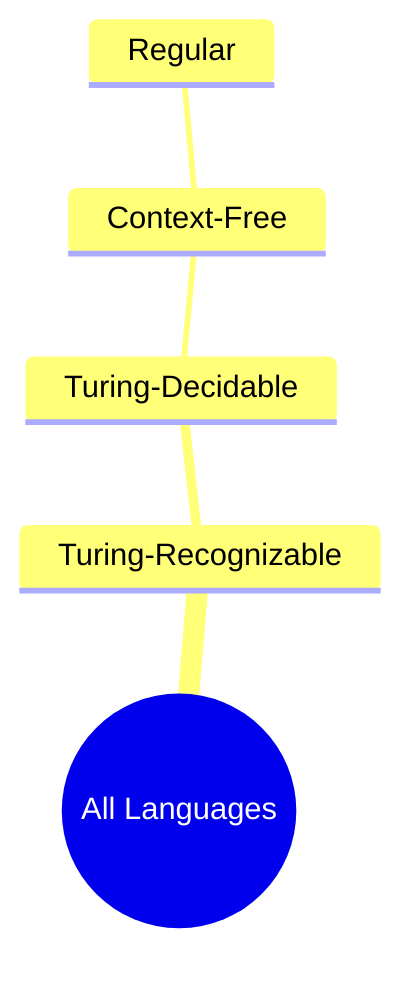
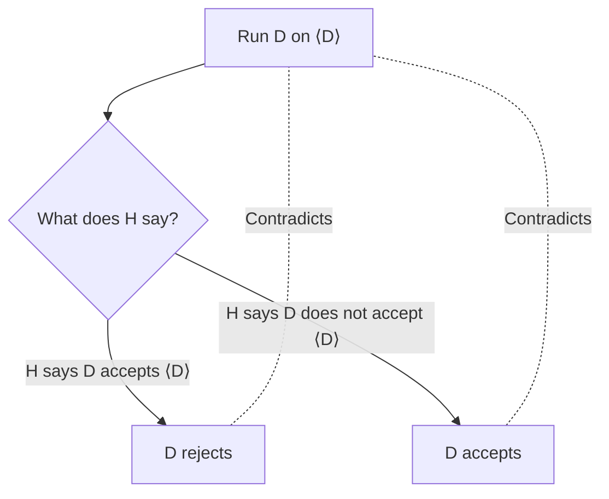
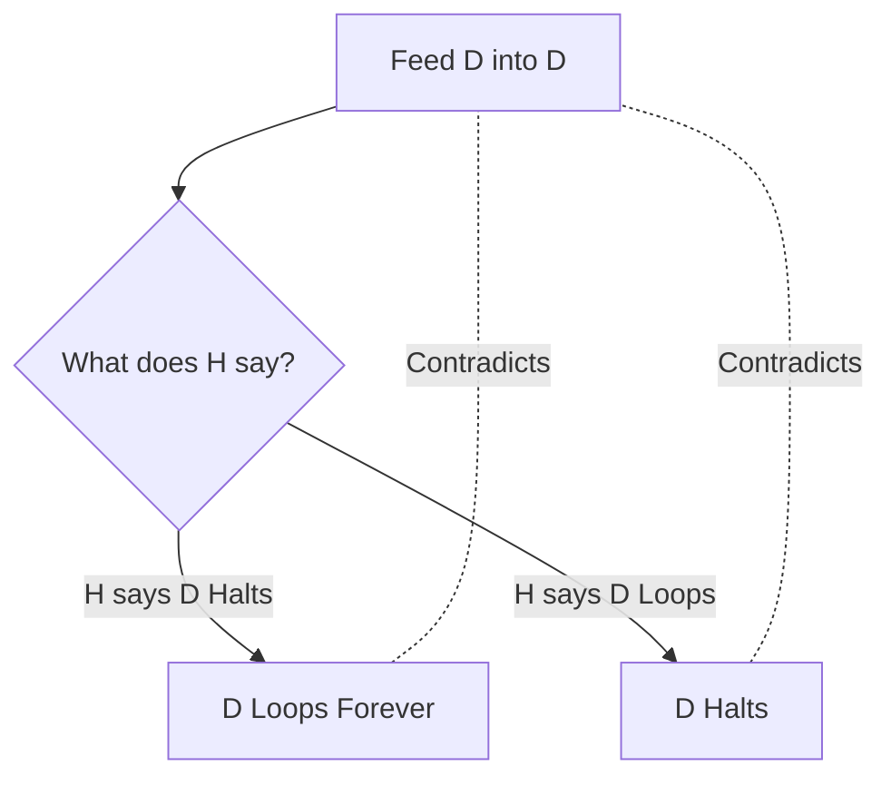

***

**Tags:** #TheoryOfComputation #TuringMachines #Decidability #HaltingProblem #Automata #ComputerScience
**Reference:** Lecture 5 — Turing Machines (Syed Rifat Raiyan)

---

## 1. Introduction to Turing Machines (TM)
Proposed by **Alan Turing (1912–1954)** in 1936, the Turing Machine is a mathematical model of computation that defines an abstract machine. It serves as the fundamental foundation for modern computer science, manipulating symbols on a strip of tape according to a table of rules.

### Features of a Standard Turing Machine:
1. **Read/Write Head:** The machine can both read from and write to the tape.
2. **Two-Way Movement:** The head can move left (L) or right (R) after each step.
3. **Infinite Memory:** The tape is semi-infinite (has a left edge but extends infinitely to the right).
4. **Blank Symbols:** Infinitely many blank symbols (`˽` or `_`) follow the actual input string.
5. **Immediate Halt:** The machine can accept or reject at *any* time; it does not need to read the entire input to make a decision.

---

## 2. Formal Definition of a Turing Machine
> [!note] Definition: 7-Tuple
> A Deterministic Turing Machine (DTM) is formally defined as a 7-tuple: $$M = (Q, \Sigma, \Gamma, \delta, q_0, q_{acc}, q_{rej})$$

- **$Q$**: Finite set of states.
- **$\Sigma$**: Input alphabet (does not contain the blank symbol `˽`).
- **$\Gamma$**: Tape alphabet, where $\Sigma \subset \Gamma$ and `˽` $\in \Gamma$.
- **$\delta$**: Transition function: $\delta: Q \times \Gamma \rightarrow Q \times \Gamma \times \{L, R\}$
  *(Given a state and a read symbol $\rightarrow$ yield a new state, a write symbol, and a move direction).*
- **$q_0$**: Start state ($q_0 \in Q$).
- **$q_{acc}$**: Accept state ($q_{acc} \in Q$).
- **$q_{rej}$**: Reject state ($q_{rej} \in Q$, and $q_{rej} \neq q_{acc}$).

### Possible Outcomes for a Given Input $w$:
Unlike finite automata, a TM has **three** possible outcomes:
1. **Accept:** Enters $q_{acc}$ and halts.
2. **Reject (by halting):** Enters $q_{rej}$ and halts.
3. **Reject (by looping):** Runs forever, never entering $q_{acc}$ or $q_{rej}$.

---

## 3. Recognizers vs. Deciders

> [!important] Turing-Recognizable vs. Turing-Decidable
> Let $M$ be a TM and $L(M)$ be the language of all strings $w$ that $M$ accepts.
> 
> - **Turing-Recognizable (Recursively Enumerable):** A language $A$ is Turing-recognizable if there exists a TM $M$ such that $A = L(M)$. If a string is in the language, the TM will eventually accept it. If it is *not*, the TM might reject it, or it might **loop forever**.
> - **Turing-Decidable (Recursive):** A language $A$ is Turing-decidable if there exists a TM $M$ that **halts on all inputs** (it never loops). Such a TM is called a **Decider**.

### The Chomsky Hierarchy
Languages form nested subsets based on their computational complexity:

*Regular $\subset$ Context-Free $\subset$ Decidable $\subset$ Recognizable.*

---

## 4. Equivalence of Turing Machine Variants
To prove the robustness of the Turing Machine model, we show that adding "features" does not increase the mathematical power of the machine. They can all be simulated by a standard single-tape DTM.

### A. Multi-Tape Turing Machines
A TM with $k$ tapes, each with its own read/write head. 
- **Theorem:** A language is T-recognizable iff some multi-tape TM recognizes it.
- **Simulation Proof:** A standard TM $S$ can simulate a multi-tape TM $M$ by separating the contents of the $k$ tapes on a single tape using a special delimiter symbol `#`. The positions of the $k$ heads are tracked using "dotted" symbols (e.g., $\dot{a}$).

### B. Nondeterministic Turing Machines (NTM)
An NTM can explore multiple computational paths simultaneously. 
- Transition function: $\delta: Q \times \Gamma \rightarrow \mathcal{P}(Q \times \Gamma \times \{L, R\})$
- **Theorem:** A language is T-recognizable iff some NTM recognizes it.
- **Simulation Proof:** A DTM simulates an NTM by performing a **Breadth-First Search (BFS)** on the nondeterministic computation tree. It copies the tape for each branch. If any branch reaches an accept state, the DTM accepts. (BFS is required because Depth-First Search might get stuck in an infinite loop).

### C. Turing Enumerators
A TM with an attached "printer". It starts with a blank tape and outputs strings to the printer.
- **Theorem:** A language is T-recognizable iff some enumerator enumerates it.
- **Simulation:** A TM can simulate an enumerator by running the TM on lexicographically generated inputs ($s_1, s_2, s_3...$). Due to looping hazards, it must use *dovetailing* (running input 1 for 1 step, then input 1 and 2 for 2 steps, etc.).

---

## 5. The Church-Turing Thesis

> [!info] The Thesis
> "Intuitive notion of algorithms equals the formal definition of Turing Machines."

The Church-Turing Thesis is not a mathematical theorem that can be proven; rather, it is a universally accepted hypothesis. It states that **any real-world computation or effective procedure can be simulated by a Turing Machine.**
- Formulated by Alan Turing and Alonzo Church (who proposed the equivalent $\lambda$-calculus).
- It means we can use high-level programming concepts (arrays, loops, objects) to describe TM algorithms.

### Encodings
To feed complex objects (graphs, polynomials, automata) into a TM, we encode them into strings. 
- $\langle O \rangle$: String encoding of object $O$.
- $\langle O_1, O_2, ... \rangle$: String encoding of multiple objects.
We write algorithms in high-level English, trusting that they can be compiled into states and transitions.

---

## 6. Decidability of Formal Languages

We can frame computational questions as **Language Acceptance Problems**.

### 1. Decidability of Regular Languages
- **$A_{DFA}$ (Acceptance):** Is decidable. We can build a TM that simulates a DFA on a string $w$ and accepts if the DFA ends in an accept state.
- **$A_{NFA}$ (Acceptance):** Is decidable. The TM first converts the NFA to a DFA (using subset construction), then runs the $A_{DFA}$ decider.
- **$E_{DFA}$ (Emptiness):** Is decidable. A TM checks if there is any valid path from the start state to an accept state using graph traversal (marking states).
- **$EQ_{DFA}$ (Equivalence):** Is decidable. A TM constructs a new DFA $C$ that represents the **symmetric difference** of DFA A and DFA B: $L(C) = (L(A) \cap \overline{L(B)}) \cup (\overline{L(A)} \cap L(B))$. If $L(C)$ is empty (using $E_{DFA}$ decider), then A and B are equivalent.

### 2. Decidability of Context-Free Languages
- **$A_{CFG}$ (Acceptance):** Is decidable. 
  - **Algorithm:** First, convert the CFG to **Chomsky Normal Form (CNF)**. In CNF, any derivation of a string of length $n$ takes exactly $2n - 1$ steps. The TM simply generates all possible derivations of length $2n - 1$ and checks if any match the input string $w$.

---

## 7. The Acceptance Problem for TMs ($A_{TM}$) and the Universal TM

Let $A_{TM} = \{\langle M, w \rangle \mid M \text{ is a TM and } M \text{ accepts } w\}$.

> [!warning] Theorem
> $A_{TM}$ is **Turing-Recognizable** but **NOT Turing-Decidable**.

**Proof of Recognizability (The Universal Turing Machine - UTM):**
We can construct a TM $U$ that recognizes $A_{TM}$:
$U$ = "On input $\langle M, w \rangle$:
1. Simulate $M$ on $w$.
2. If $M$ halts and accepts, *accept*.
3. If $M$ halts and rejects, *reject*.

*Note:* If $M$ loops forever on $w$, $U$ also loops forever. Therefore, $U$ is a recognizer, not a decider. The concept of the UTM inspired John von Neumann's architecture for the **stored-program computer**.

**Proof of Undecidability (Diagonalization):**
We prove by contradiction that no decider for $A_{TM}$ can exist.

1. **Assume** there exists a TM $H$ that decides $A_{TM}$:
   - $H(\langle M, w \rangle)$ **accepts** if $M$ accepts $w$.
   - $H(\langle M, w \rangle)$ **rejects** if $M$ rejects or loops on $w$.

2. **Construct** a TM $D$ ("Diagonalizer") that uses $H$ as a subroutine:
   $D$ = "On input $\langle M \rangle$:
   1. Run $H$ on $\langle M, \langle M \rangle \rangle$.
   2. If $H$ accepts, **reject**.
   3. If $H$ rejects, **accept**."
   
   In other words: $D$ accepts $\langle M \rangle$ **iff** $M$ does *not* accept $\langle M \rangle$.

3. **The Paradox:** What happens when $D$ runs on its own encoding $\langle D \rangle$?
   - If $D$ accepts $\langle D \rangle$, then by definition $D$ does *not* accept $\langle D \rangle$. (Contradiction!)
   - If $D$ does not accept $\langle D \rangle$, then by definition $D$ *does* accept $\langle D \rangle$. (Contradiction!)

### Conclusion
Because $D$ creates a paradox that cannot exist, our initial assumption must be false. **Therefore, $H$ (a machine that decides $A_{TM}$) cannot exist.**

---

## 8. The Halting Problem

The Halting Problem asks: *Given a program and an input, can we write a program that guarantees to tell us whether the original program will eventually halt or run forever?*

Let $HALT_{TM} = \{\langle M, w \rangle \mid M \text{ is a TM and } M \text{ halts on input } w\}$.

> [!danger] Theorem 5.1
> $HALT_{TM}$ is **Undecidable**.

### The Proof by Contradiction (Diagonalization)
We prove this by assuming a decider for the Halting Problem exists, and showing it leads to a logical paradox.

1. **Assume** there exists a TM $H$ that decides $HALT_{TM}$. 
   - $H(\langle M, w \rangle)$ outputs **Accept** if $M$ halts on $w$.
   - $H(\langle M, w \rangle)$ outputs **Reject** if $M$ loops on $w$.

2. **Construct** a new malicious TM called $D$ (the "Deceiver" or "Paradox" machine) that uses $H$ as a subroutine.
   $D$ = "On input $\langle M \rangle$:"
   - Run $H$ on $\langle M, \langle M \rangle \rangle$ (asking: "Does machine $M$ halt when given its own code as input?").
   - **Do the opposite:**
     - If $H$ says $M$ halts $\rightarrow$ $D$ loops forever.
     - If $H$ says $M$ loops $\rightarrow$ $D$ halts and accepts.

3. **The Paradox:** What happens when we run $D$ on itself, i.e., $D(\langle D \rangle)$?
   - If $D$ halts, then $H$ outputs *Accept*. But $D$ is programmed to loop if $H$ accepts. (Contradiction!)
   - If $D$ loops, then $H$ outputs *Reject*. But $D$ is programmed to halt if $H$ rejects. (Contradiction!)

### Conclusion
Because $D$ creates a paradox that cannot exist, our initial assumption must be false. **Therefore, $H$ (a machine that decides the Halting Problem) cannot exist.**

### Alternative Proof: Reduction from $A_{TM}$
We can also prove $HALT_{TM}$ is undecidable by showing that **if it were decidable, $A_{TM}$ would also be decidable** (which is false). This is a **reduction**: $A_{TM} \leq_m HALT_{TM}$.

1. **Assume** there exists a TM $R$ that decides $HALT_{TM}$:
   - $R(\langle M, w \rangle)$ **accepts** if $M$ halts on $w$.
   - $R(\langle M, w \rangle)$ **rejects** if $M$ loops on $w$.

2. **Construct** a decider $S$ for $A_{TM}$ using $R$ as a subroutine:
   $S$ = "On input $\langle M, w \rangle$:
   1. Run $R$ on $\langle M, w \rangle$.
   2. If $R$ rejects, **reject** (since $M$ loops, it can never accept).
   3. If $R$ accepts, **simulate $M$ on $w$** and output whatever $M$ does."

3. **Why $S$ always halts:** Step 1 ($R$) always halts. If $R$ says $M$ halts, the simulation in step 3 is **guaranteed to terminate**. So $S$ never loops on any input.

4. **Contradiction:** $S$ decides $A_{TM}$, but we already proved $A_{TM}$ is undecidable. Therefore, $R$ cannot exist.

> *Computers will solve all my problems!* -> **No. Not all problems are computationally solvable.**