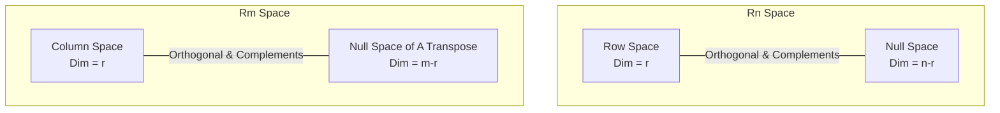

**Lecturer:** Gilbert Strang
**Source:** MIT OpenCourseWare
**Tags:** #LinearAlgebra #Orthogonality #Subspaces #NullSpace #RowSpace #Matrices
**Checked:** No

---

## 1. Orthogonal Vectors

The concept of orthogonality is the generalization of "perpendicular" to $n$-dimensional space.

### Definition
Two vectors $x$ and $y$ are **orthogonal** if their dot product is zero.
$$ x^T y = 0 $$
*(Note: Since $x^T y = y^T x$, the order does not matter)*.

### Pythagorean Theorem Connection
Vectors are orthogonal if and only if they satisfy the Pythagorean theorem.
For vectors, the length squared is defined as $\|x\|^2 = x^T x$.

**Theorem:** $x \perp y \iff \|x\|^2 + \|y\|^2 = \|x+y\|^2$

**Proof:**
$$ \|x+y\|^2 = (x+y)^T (x+y) = x^Tx + x^Ty + y^Tx + y^Ty $$
$$ \|x+y\|^2 = \|x\|^2 + \|y\|^2 + 2x^Ty $$
For the equation to hold, the term $2x^Ty$ must be zero.

> [!NOTE] Zero Vector
> The zero vector $\vec{0}$ is orthogonal to **every** vector.
> $0^T y = 0$ is always true.

### Example
Let $x = \begin{bmatrix} 1 \\ 2 \\ 3 \end{bmatrix}$.
$$ \|x\|^2 = 1^2 + 2^2 + 3^2 = 1 + 4 + 9 = 14 $$
To find a vector $y$ orthogonal to $x$:
Let $y = \begin{bmatrix} 2 \\ -1 \\ 0 \end{bmatrix}$.
$$ x^T y = (1)(2) + (2)(-1) + (3)(0) = 2 - 2 + 0 = 0 $$
Check lengths:
$$ \|y\|^2 = 5 $$
$$ x+y = \begin{bmatrix} 3 \\ 1 \\ 3 \end{bmatrix} \implies \|x+y\|^2 = 9 + 1 + 9 = 19 $$
$$ 14 + 5 = 19 \quad \text{(Pythagoras holds)} $$

---

## 2. Orthogonal Subspaces

What does it mean for a whole **subspace** $S$ to be orthogonal to another subspace $T$?

### Definition
Subspace $S$ is orthogonal to subspace $T$ if **every** vector in $S$ is orthogonal to **every** vector in $T$.
$$ v \in S, w \in T \implies v^T w = 0 $$

### Crucial Distinction (Non-Example)
Consider two planes in $\mathbb{R}^3$ (e.g., a wall and the floor) meeting at a line. Are they orthogonal subspaces?
**NO.**
1. They meet at a line (non-zero vectors).
2. If vector $v$ is in the intersection (the line), it belongs to both $S$ and $T$.
3. $v$ is not orthogonal to itself (unless $v=0$).
4. Therefore, distinct subspaces in $\mathbb{R}^3$ (planes) cannot be orthogonal if their dimensions add up to more than 3 (they must intersect).

> [!TIP] Visualizing Orthogonal Subspaces in $\mathbb{R}^3$
> *   Two lines passing through the origin can be orthogonal.
> *   A line and a plane passing through the origin can be orthogonal (like a normal vector sticking out of a plane).

---

## 3. The Big Picture: Orthogonality of Fundamental Subspaces

The fundamental subspaces of a matrix $A$ have specific orthogonality relationships.

### Row Space $\perp$ Null Space
The **Row Space** is orthogonal to the **Null Space**. Both are in $\mathbb{R}^n$.

**Why?**
The definition of the null space is $Ax = 0$.
$$
\begin{bmatrix}
— & \text{row } 1 & — \\
— & \text{row } 2 & — \\
& \vdots & \\
— & \text{row } m & —
\end{bmatrix}
\begin{bmatrix}
\\ x \\ \\
\end{bmatrix} =
\begin{bmatrix}
0 \\ 0 \\ \vdots \\ 0
\end{bmatrix}
$$
This matrix multiplication means:
1. $(row_1) \cdot x = 0$
2. $(row_2) \cdot x = 0$
3. ...
4. $(row_m) \cdot x = 0$

Since $x$ is orthogonal to every individual row, it is orthogonal to any linear combination of the rows. Therefore, any vector in the Null Space is orthogonal to any vector in the Row Space.

### Column Space $\perp$ Left Null Space
Similarly, the **Column Space** is orthogonal to the **Null Space of $A^T$** (Left Null Space). Both are in $\mathbb{R}^m$.

---

## 4. Orthogonal Complements

It is not enough to say the Row Space and Null Space are simply orthogonal. We can be more precise. Their dimensions add up to the full dimension of the space ($r + (n-r) = n$).

### Definition
The **orthogonal complement** of a subspace $V$ (denoted $V^\perp$) contains **all** vectors that are orthogonal to $V$.

### Fundamental Theorem of Linear Algebra (Part 2)
1. **Null Space is the orthogonal complement of Row Space (in $\mathbb{R}^n$).**
   $$ N(A) = (C(A^T))^\perp $$
2. **Left Null Space is the orthogonal complement of Column Space (in $\mathbb{R}^m$).**
   $$ N(A^T) = (C(A))^\perp $$

This means the Null Space doesn't just contain *some* vectors orthogonal to the rows; it contains **all** of them. These subspaces divide the entire space into two perpendicular parts.

### Visual Representation

---

## 5. Solving $Ax = b$ when no solution exists

This introduces the next major topic (Projections and Least Squares).
Usually, $m > n$ (more equations than unknowns). The system $Ax=b$ often has no solution because $b$ is not in the Column Space ($b \notin C(A)$).

We cannot solve $Ax=b$, so we solve for the "best possible" $\hat{x}$. To do this, we multiply by $A^T$:

$$ A^T A \hat{x} = A^T b $$

This is the central equation for Chapter 4.

### The Matrix $A^T A$
This matrix appears constantly in applied mathematics.
Key properties of $A^T A$:
1.  **Shape:** It is always square ($n \times n$).
2.  **Symmetry:** It is always symmetric.
    *   Proof: $(A^T A)^T = A^T (A^T)^T = A^T A$.
3.  **Invertibility:**
    *   $A^T A$ is invertible if and only if the columns of $A$ are linearly independent (Rank = $n$).
    *   If $A$ has independent columns, the null space of $A^T A$ is the same as the null space of $A$ (which is just the zero vector).

### Matrix Rank Example
Let $A = \begin{bmatrix} 1 & 1 \\ 1 & 2 \\ 1 & 5 \end{bmatrix}$. ($m=3, n=2$).
Columns are independent, rank = 2.

Calculate $A^T A$:
$$
A^T A = \begin{bmatrix} 1 & 1 & 1 \\ 1 & 2 & 5 \end{bmatrix} \begin{bmatrix} 1 & 1 \\ 1 & 2 \\ 1 & 5 \end{bmatrix} = \begin{bmatrix} 3 & 8 \\ 8 & 30 \end{bmatrix}
$$
*   Result is $2 \times 2$.
*   Result is symmetric.
*   Result is invertible (Determinant = $90 - 64 \neq 0$).

**Conclusion:** The rank of $A^T A$ equals the rank of $A$.