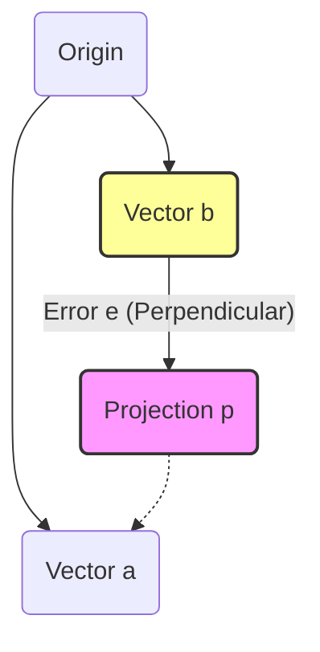

**Tags:** #linear-algebra #mit-1806 #matrices #projections #least-squares #gilbert-strang
**Lecturer:** Gilbert Strang
**Checked:** No

---

## 1. Projection in 1D (Projecting a Vector onto a Line)

**The Goal:** We want to find the point $p$ on the line through vector $a$ that is closest to vector $b$.

### The Geometry
We define:
*   **$b$**: The vector we want to project.
*   **$a$**: The vector defining the line (the subspace).
*   **$p$**: The projection of $b$ onto $a$. Since $p$ is on the line, $p = \hat{x}a$ for some scalar $\hat{x}$.
*   **$e$**: The error vector. $e = b - p$.

**Crucial Insight:** The error vector $e$ is **perpendicular (orthogonal)** to the line $a$.

### The Derivation
Since $a \perp e$, their dot product is zero:
$$a^T e = 0$$
$$a^T (b - \hat{x}a) = 0$$

Expanding this:
$$a^Tb - \hat{x}a^Ta = 0$$

Solving for the scalar $\hat{x}$:
$$ \hat{x} = \frac{a^T b}{a^T a} $$

Therefore, the projection vector $p$ is:
$$ p = a\hat{x} = a \frac{a^T b}{a^T a} $$

> [!NOTE] Interpretation
> *   $a^Tb$: A number (dot product).
> *   $a^Ta$: A number (length squared of $a$).
> *   $\hat{x}$: The factor required to stretch/shrink $a$ to reach $p$.

---

## 2. The Projection Matrix (1D)

If we treat the projection as a linear transformation acting on $b$, we can separate out the matrix part.

$$ p = a \frac{a^T b}{a^T a} = \frac{a a^T}{a^T a} b $$

We define the **Projection Matrix $P$**:
$$ P = \frac{a a^T}{a^T a} $$

> [!WARNING] Matrix Order Matters
> In the numerator, $aa^T$ is a **column times a row**, which results in a full rank-1 matrix (not a number).
> In the denominator, $a^Ta$ is a **row times a column**, which is a scalar number.

### Properties of Matrix $P$
1.  **Rank:** The column space of $P$ is the line through $a$. The rank is **1**.
2.  **Symmetry:** $P^T = P$.
    *   $(aa^T)^T = aa^T$ and the denominator is just a number.
3.  **Idempotence:** $P^2 = P$.
    *   **Geometric intuition:** If you project $b$ onto a line to get $p$, and then project $p$ onto the same line, you stay at $p$. Projecting twice is the same as projecting once.

---

## 3. Why Project? (The Least Squares Problem)

We usually project because the system of linear equations $Ax = b$ has **no solution**.
*   This happens when $m > n$ (more equations than unknowns).
*   The vector $b$ is **not** in the Column Space of $A$ ($C(A)$).

**The Strategy:**
Since we cannot solve $Ax = b$, we solve for the "closest" vector in the column space. We replace $b$ with its projection $p$ onto $C(A)$. We solve:
$$ A\hat{x} = p $$
Where $\hat{x}$ is the "best" solution (Least Squares solution).

---

## 4. Projection in N-Dimensions (Subspace)

Now, we project $b$ onto a subspace (e.g., a plane) defined by the columns of matrix $A$ ($a_1, a_2, \dots$).

### The Geometry
*   $p = A\hat{x}$ is in the plane (Column Space).
*   $e = b - A\hat{x}$ is the error vector.
*   **Orthogonality:** $e$ is perpendicular to the *entire* plane. This means $e$ is perpendicular to every column of $A$.

This implies $e$ is in the **Nullspace of $A^T$** (The Left Nullspace).

### The Equations
$$ A^T e = 0 $$
$$ A^T (b - A\hat{x}) = 0 $$

Rearranging gives the famous **Normal Equations**:
> [!important] The Normal Equations
> $$ A^T A \hat{x} = A^T b $$

### Solutions and Matrices
From the Normal Equations, we can find $\hat{x}$, $p$, and the Matrix $P$.

1.  **The Best Solution $\hat{x}$:**
    $$ \hat{x} = (A^T A)^{-1} A^T b $$
    *(Note: $A^T A$ is square ($n \times n$) and invertible if columns of A are independent).*

2.  **The Projection Vector $p$:**
    $$ p = A\hat{x} = A (A^T A)^{-1} A^T b $$

3.  **The Projection Matrix $P$:**
    $$ P = A (A^T A)^{-1} A^T $$

### Why we can't simplify $(A^T A)^{-1}$
You might be tempted to simplify $(A^T A)^{-1}$ to $A^{-1} (A^T)^{-1}$.
**Do NOT do this.**
*   $A$ is not a square matrix ($m \times n$).
*   It does not have an inverse.
*   We must keep $(A^T A)^{-1}$ intact.
*   *Note:* If $A$ were square and invertible, the projection onto its column space would be the whole space (Identity matrix). If you plug invertible square matrices into the formula, it simplifies to $I$.

---

## 5. Properties of the N-Dimensional Projection Matrix

The matrix $P = A (A^T A)^{-1} A^T$ shares the properties of the 1D version:

1.  **Symmetry ($P^T = P$):**
    $$ P^T = (A ((A^T A)^{-1}) A^T)^T $$
    Using $(ABC)^T = C^T B^T A^T$ and the fact that $(M^{-1})^T = (M^T)^{-1}$:
    $$ P^T = A ((A^T A)^T)^{-1} A^T = A (A^T A)^{-1} A^T = P $$

2.  **Idempotence ($P^2 = P$):**
    $$ P^2 = [A (A^T A)^{-1} A^T] [A (A^T A)^{-1} A^T] $$
    Group the middle terms:
    $$ P^2 = A \underbrace{(A^T A)^{-1} (A^T A)}_{I} (A^T A)^{-1} A^T $$
    $$ P^2 = A (A^T A)^{-1} A^T = P $$

---

## 6. Application: Least Squares (Fitting a Line)

**Example:** Fit a straight line $C + Dt = b$ through three points:
*   $(1, 1)$
*   $(2, 2)$
*   $(3, 2)$

### 1. Set up the (unsolvable) equations
We try to plug the points into $C + Dt = b$:
1.  $C + 1D = 1$
2.  $C + 2D = 2$
3.  $C + 3D = 2$

### 2. Matrix Form $Ax = b$
$$
\underbrace{\begin{bmatrix} 1 & 1 \\ 1 & 2 \\ 1 & 3 \end{bmatrix}}_{A}
\underbrace{\begin{bmatrix} C \\ D \end{bmatrix}}_{x}
=
\underbrace{\begin{bmatrix} 1 \\ 2 \\ 2 \end{bmatrix}}_{b}
$$

There is no line that goes through all three points perfectly (no solution).

### 3. Solve the Normal Equations $A^T A \hat{x} = A^T b$

**Calculate $A^T A$:**
$$
\begin{bmatrix} 1 & 1 & 1 \\ 1 & 2 & 3 \end{bmatrix}
\begin{bmatrix} 1 & 1 \\ 1 & 2 \\ 1 & 3 \end{bmatrix}
=
\begin{bmatrix} 3 & 6 \\ 6 & 14 \end{bmatrix}
$$

**Calculate $A^T b$:**
$$
\begin{bmatrix} 1 & 1 & 1 \\ 1 & 2 & 3 \end{bmatrix}
\begin{bmatrix} 1 \\ 2 \\ 2 \end{bmatrix}
=
\begin{bmatrix} 5 \\ 11 \end{bmatrix}
$$

**The System to Solve for Best $\hat{C}, \hat{D}$:**
$$
\begin{bmatrix} 3 & 6 \\ 6 & 14 \end{bmatrix}
\begin{bmatrix} \hat{C} \\ \hat{D} \end{bmatrix}
=
\begin{bmatrix} 5 \\ 11 \end{bmatrix}
$$

Solving this system gives the "best" line (the line that minimizes the sum of squared vertical errors).

---

## Summary of Key Formulas

| Concept | Formula |
| :--- | :--- |
| **Projection Matrix** | $P = A(A^T A)^{-1} A^T$ |
| **Normal Equation** | $A^T A \hat{x} = A^T b$ |
| **Best Solution** | $\hat{x} = (A^T A)^{-1} A^T b$ |
| **Projected Vector** | $p = Pb$ |
| **Projection Properties** | $P^T = P$ and $P^2 = P$ |
