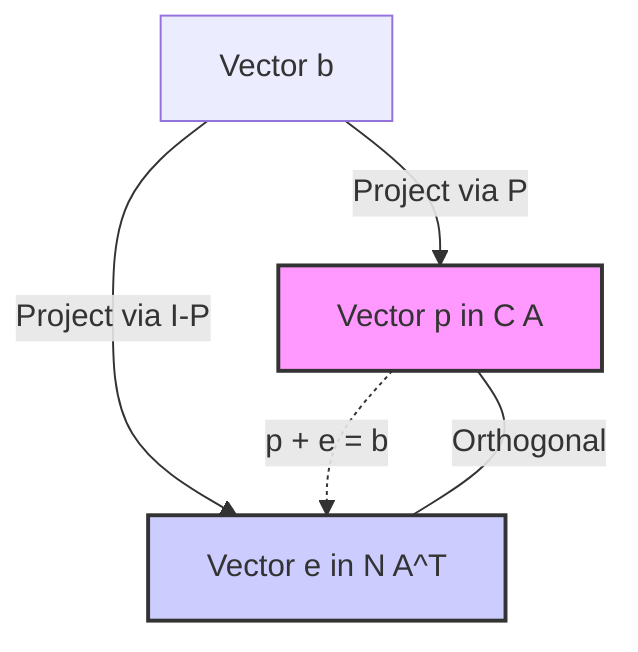

**Lecturer:** Gilbert Strang
**Topic:** Projections, Least Squares, and Fitting Lines
**Date:** [Current Date]
**Tags:** #LinearAlgebra #Mathematics #Matrices #LeastSquares #Projections
**Checked:** No

---

## 1. Recap: The Projection Matrix

In the previous lecture, we derived the formula for the projection matrix $P$ that projects a vector $b$ onto the column space of matrix $A$.

### The Formula
$$P = A(A^T A)^{-1} A^T$$

### Two Extreme Cases
To understand why this formula works, we look at two extreme positions for vector $b$:

1.  **Case 1: $b$ is already in the Column Space ($b \in C(A)$)**
    *   If $b$ is in the column space, it is a linear combination of the columns: $b = Ax$ for some $x$.
    *   Applying $P$:
        $$Pb = A(A^T A)^{-1} A^T (Ax)$$
    *   The term $(A^T A)^{-1} (A^T A)$ cancels out to the Identity matrix $I$.
    *   **Result:** $Pb = Ax = b$. (The projection of a vector already in the space is the vector itself).

2.  **Case 2: $b$ is perpendicular to the Column Space ($b \perp C(A)$)**
    *   If $b$ is perpendicular to the column space, it lies in the **Left Nullspace** ($N(A^T)$).
    *   This means $A^T b = 0$.
    *   Applying $P$:
        $$Pb = A(A^T A)^{-1} (A^T b)$$
    *   Since $A^T b = 0$, the whole expression becomes zero.
    *   **Result:** $Pb = 0$. (The projection kills the perpendicular component).

---

## 2. Geometry of Projections

We decompose any vector $b$ into two components:
1.  **$p$**: The component in the column space ($p = Pb$).
2.  **$e$**: The error component perpendicular to the column space ($e = b - p$).

$$b = p + e$$

### The Projection onto the Orthogonal Complement
If $P$ projects onto the column space, what matrix projects onto the perpendicular space (the left nullspace)?
*   Since $e = b - p = b - Pb = (I - P)b$.
*   The projection matrix for the error term is **$I - P$**.

> [!INFO] Properties of P
> *   $P$ is symmetric ($P^T = P$).
> *   $P^2 = P$ (Projecting a second time doesn't change anything).
> *   Consequently, $I-P$ is also symmetric and $(I-P)^2 = (I-P)$.

### Visual Representation (Mermaid)

---

## 3. Least Squares Regression (Fitting a Line)

This is the primary application of projections.

**The Problem:** We want to find the "best" straight line $y = C + Dt$ that fits a set of data points.
**Data Points:** $(1, 1)$, $(2, 2)$, $(3, 2)$.

### Setting up the Equations
We try to solve for $C$ and $D$ using the data points:
1. At $t=1, y=1 \Rightarrow C + 1D = 1$
2. At $t=2, y=2 \Rightarrow C + 2D = 2$
3. At $t=3, y=2 \Rightarrow C + 3D = 2$

### Matrix Form ($Ax = b$)
$$
\underbrace{\begin{bmatrix} 1 & 1 \\ 1 & 2 \\ 1 & 3 \end{bmatrix}}_{A}
\underbrace{\begin{bmatrix} C \\ D \end{bmatrix}}_{x} =
\underbrace{\begin{bmatrix} 1 \\ 2 \\ 2 \end{bmatrix}}_{b}
$$

*   **Conflict:** There is no solution. The line cannot pass through all three points (they are not collinear).
*   **Vector Interpretation:** Vector $b$ is not in the column space of $A$. We have 3 equations and only 2 unknowns.

### The Goal: Minimize Error
We cannot solve $Ax = b$. Instead, we solve for the "best" estimate $\hat{x}$ ($\hat{C}, \hat{D}$) that minimizes the error vector $e$.
$$e = b - A\hat{x}$$
We want to minimize the length squared of the error:
$$\text{Minimize } \|Ax - b\|^2 = \|e\|^2 = e_1^2 + e_2^2 + e_3^2$$

> [!NOTE] Outliers
> Strang notes that Least Squares (squaring the errors) penalizes "outliers" (points far from the line) heavily. Statisticians sometimes use other methods if outliers are essentially bad data, but Least Squares is the standard linear algebra approach.

---

## 4. The Normal Equations

How do we find $\hat{x}$? We can use Calculus or Linear Algebra.

### Method 1: Calculus
Write out the sum of squares error:
$$E = (C+D-1)^2 + (C+2D-2)^2 + (C+3D-2)^2$$
Take partial derivatives with respect to $C$ and $D$, set them to zero, and solve. This leads to a linear system.

### Method 2: Geometry (The "Big Picture")
The error vector $e = b - A\hat{x}$ connects the vector $b$ to the closest point in the column space ($p$). Geometrically, the shortest path is **perpendicular** to the surface (the column space).

1.  $e$ is perpendicular to the columns of $A$.
2.  Therefore, $e$ is in the Left Nullspace of $A$ ($N(A^T)$).
3.  $A^T e = 0$.
4.  Substitute $e = b - A\hat{x}$:
    $$A^T (b - A\hat{x}) = 0$$

Rearranging this gives the most famous equation in statistics/estimation:

> [!thm] The Normal Equations
> $$A^T A \hat{x} = A^T b$$

Once we solve this for $\hat{x}$, the projection is $p = A\hat{x}$.

---

## 5. Solving the Example

Let's compute the components for the Normal Equations using our data.

**1. Compute $A^T A$:**
$$
A^T A = \begin{bmatrix} 1 & 1 & 1 \\ 1 & 2 & 3 \end{bmatrix} \begin{bmatrix} 1 & 1 \\ 1 & 2 \\ 1 & 3 \end{bmatrix} = \begin{bmatrix} 3 & 6 \\ 6 & 14 \end{bmatrix}
$$
*Note: $A^T A$ is symmetric.*

**2. Compute $A^T b$:**
$$
A^T b = \begin{bmatrix} 1 & 1 & 1 \\ 1 & 2 & 3 \end{bmatrix} \begin{bmatrix} 1 \\ 2 \\ 2 \end{bmatrix} = \begin{bmatrix} 5 \\ 11 \end{bmatrix}
$$

**3. Solve the System:**
$$
\begin{bmatrix} 3 & 6 \\ 6 & 14 \end{bmatrix} \begin{bmatrix} \hat{C} \\ \hat{D} \end{bmatrix} = \begin{bmatrix} 5 \\ 11 \end{bmatrix}
$$

*   Equation 1: $3C + 6D = 5$
*   Equation 2: $6C + 14D = 11$

Subtract $2 \times (\text{Eq 1})$ from $\text{Eq 2}$:
$$(6C + 14D) - (6C + 12D) = 11 - 10$$
$$2D = 1 \Rightarrow \hat{D} = \frac{1}{2}$$

Substitute back into Eq 1:
$$3C + 6(1/2) = 5 \Rightarrow 3C + 3 = 5 \Rightarrow 3C = 2 \Rightarrow \hat{C} = \frac{2}{3}$$

**Result:** The best fitting line is **$y = \frac{2}{3} + \frac{1}{2}t$**.

### Calculating the Vectors
*   **$p$ (Predicted values on the line):**
    *   $t=1: 2/3 + 1/2 = 7/6$
    *   $t=2: 2/3 + 1 = 5/3 = 10/6$
    *   $t=3: 2/3 + 3/2 = 13/6$
    $$p = \begin{bmatrix} 7/6 \\ 10/6 \\ 13/6 \end{bmatrix}$$

*   **$e$ (Error vector $b - p$):**
    *   $1 - 7/6 = -1/6$
    *   $2 - 10/6 = 2/6$
    *   $2 - 13/6 = -1/6$
    $$e = \begin{bmatrix} -1/6 \\ 2/6 \\ -1/6 \end{bmatrix}$$

*   **Verification:** $p$ and $e$ are perpendicular.
    $$(7/6)(-1/6) + (10/6)(2/6) + (13/6)(-1/6) = (-7 + 20 - 13) / 36 = 0$$
    Also, $e$ is perpendicular to columns of $A$ (e.g., column of 1s: $-1/6 + 2/6 - 1/6 = 0$).

---

## 6. Critical Theorem: Invertibility of $A^T A$

To solve the normal equations, the matrix $A^T A$ must be invertible. When is this true?

> [!thm] Theorem
> If the columns of $A$ are **linearly independent**, then $A^T A$ is invertible.

### Proof
We want to show that if $A$ has independent columns, the nullspace of $A^T A$ contains only the zero vector ($x=0$).

1.  Suppose $A^T A x = 0$.
2.  Multiply both sides by $x^T$:
    $$x^T A^T A x = 0$$
3.  Recognize that $(Ax)^T (Ax) = 0$.
4.  This is the squared length of the vector $Ax$: $\|Ax\|^2 = 0$.
5.  Therefore, the vector $Ax$ must be the zero vector: $Ax = 0$.
6.  Since $A$ has **independent columns**, the only solution to $Ax = 0$ is $x = 0$.
7.  Therefore, $A^T A$ is invertible.

### Looking Ahead
If the columns of $A$ are **Orthonormal** (perpendicular unit vectors), then $A^T A = I$. This makes the calculation trivial because the coupled equations disappear, and you essentially solve for each coefficient independently.