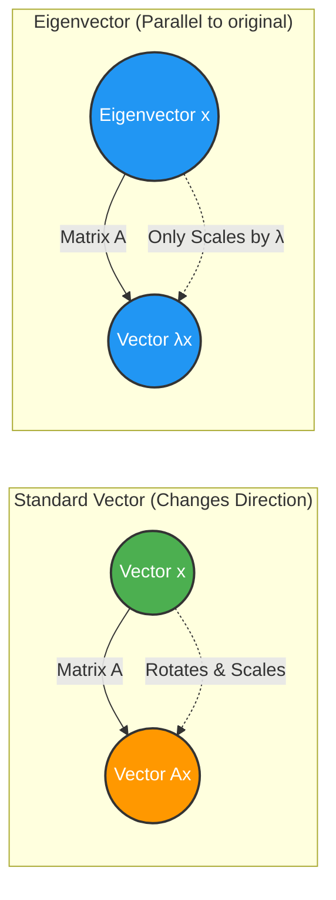

***

# Linear Algebra: 

**Tags:** #linear-algebra #math #eigenvalues #eigenvectors #matrices #MIT1806 
**Checked**: No

> [!abstract] Core Concept
> A matrix $A$ acts as a function that transforms vectors. Most vectors change direction when multiplied by a matrix. **Eigenvectors** are the special, exceptional vectors that *stay in the same direction* after the transformation. They are only scaled by a specific number, which is called the **Eigenvalue**.

## 1. The Fundamental Equation

The relationship between a square matrix $A$, an eigenvector $x$, and its eigenvalue $\lambda$ is defined by:

$$Ax = \lambda x$$

*   **$A$**: A square $n \times n$ matrix.
*   **$x$**: The **Eigenvector** (must be non-zero). It is the vector that does not change direction.
*   **$\lambda$**: The **Eigenvalue**. The scalar multiplier. 
    *   If $\lambda > 0$: $x$ stretches or shrinks but points the exact same way.
    *   If $\lambda < 0$: $x$ flips $180^\circ$ to the exact opposite direction.
    *   If $\lambda = 0$: $x$ is squashed to the zero vector. 

### Visual Intuition

---

## 2. How to Calculate Eigenvalues and Eigenvectors

Because we have two unknowns ($\lambda$ and $x$) multiplying each other, we cannot use standard elimination. We must follow a specific process.

### Step 1: The Characteristic Equation
Bring everything to one side of the equation:
$$Ax - \lambda x = 0$$
Factor out $x$ by introducing the Identity matrix $I$:
$$(A - \lambda I)x = 0$$

> [!info] The Key Insight
> For $x$ to be a non-zero vector, the matrix $(A - \lambda I)$ **must be singular** (it must have no inverse, meaning its null space contains more than just the zero vector). 
> A matrix is singular if and only if its determinant is zero.

Therefore, to find $\lambda$, we solve the **Characteristic Equation**:
$$\det(A - \lambda I) = 0$$

### Step 2: Find the Eigenvectors
Once you find the roots ($\lambda_1, \lambda_2, \dots, \lambda_n$) of the characteristic equation, you plug them back into $(A - \lambda I)x = 0$ one by one.
Finding the eigenvector $x$ simply means finding the **null space** of $(A - \lambda I)$.

---

## 3. Crucial Properties of Eigenvalues

There are two major "sanity checks" in linear algebra regarding eigenvalues. For an $n \times n$ matrix with eigenvalues $\lambda_1, \lambda_2, \dots, \lambda_n$:

1.  **The Trace Rule:** The sum of the eigenvalues equals the Trace of the matrix (the sum of the numbers on the main diagonal).
    $$\lambda_1 + \lambda_2 + \dots + \lambda_n = a_{11} + a_{22} + \dots + a_{nn} = \text{Trace}(A)$$
2.  **The Determinant Rule:** The product of the eigenvalues equals the determinant of the matrix.
    $$\lambda_1 \cdot \lambda_2 \cdot \dots \cdot \lambda_n = \det(A)$$

> [!warning] A Common Pitfall
> You **cannot** simply add or multiply eigenvalues of different matrices.
> *   The eigenvalues of $(A + B)$ are generally **not** $\lambda_A + \lambda_B$.
> *   The eigenvalues of $(AB)$ are generally **not** $\lambda_A \lambda_B$.
> *   *Why?* Because $A$ and $B$ usually have completely different eigenvectors. (If they share the exact same eigenvectors, then the rules do apply).

---

## 4. Eigenvalues of Transformed Matrices

If you know that $v$ is an eigenvector of $A$ with eigenvalue $\lambda$, you instantly know the eigenvalues and eigenvectors for matrix operations on $A$. 

**Proof for $A^2$:**
$$A^2v = A(Av) = A(\lambda v) = \lambda(Av) = \lambda(\lambda v) = \lambda^2 v$$

**Proof for $A^{-1}$:**
$$Av = \lambda v \implies A^{-1}Av = A^{-1}\lambda v \implies v = \lambda A^{-1}v \implies A^{-1}v = \frac{1}{\lambda}v$$

| Matrix Operation | New Eigenvalue | New Eigenvector |
| :--- | :--- | :--- |
| $A$ | $\lambda$ | $v$ |
| $A^2$ | $\lambda^2$ | $v$ (Unchanged) |
| $A^k$ | $\lambda^k$ | $v$ (Unchanged) |
| $A^{-1}$ | $\lambda^{-1}$ (or $1/\lambda$) | $v$ (Unchanged) |
| $A \pm cI$ | $\lambda \pm c$ | $v$ (Unchanged) |

---

## 5. Detailed Examples

### Example 1: The Projection Matrix (Geometrical Intuition)
Let $P$ be a matrix that projects any vector down onto a specific flat plane.
*   **Vector in the plane:** If $x$ is already in the plane, $Px = x$. 
    *   **Eigenvalue:** $\lambda = 1$.
    *   **Eigenvectors:** A whole plane of them.
*   **Vector perpendicular to the plane:** If $x$ is pointing straight up from the plane, its projection is $0$. $Px = 0x$.
    *   **Eigenvalue:** $\lambda = 0$ (This confirms the matrix is singular).
    *   **Eigenvector:** The vector perpendicular to the plane (the null space).

### Example 2: The Permutation Matrix
Let $A = \begin{bmatrix} 0 & 1 \\ 1 & 0 \end{bmatrix}$. This matrix swaps the $x_1$ and $x_2$ components of a vector.
*   Trace = $0$, Det = $-1$. 
*   **Vector $\begin{bmatrix} 1 \\ 1 \end{bmatrix}$:** Swapping makes it $\begin{bmatrix} 1 \\ 1 \end{bmatrix}$. Therefore, $x_1 = \begin{bmatrix} 1 \\ 1 \end{bmatrix}, \lambda_1 = 1$.
*   **Vector $\begin{bmatrix} -1 \\ 1 \end{bmatrix}$:** Swapping makes it $\begin{bmatrix} 1 \\ -1 \end{bmatrix}$, which is $-1 \cdot \begin{bmatrix} -1 \\ 1 \end{bmatrix}$. Therefore, $x_2 = \begin{bmatrix} -1 \\ 1 \end{bmatrix}, \lambda_2 = -1$.
*   *Sanity Check:* $\lambda_1 + \lambda_2 = 1 + (-1) = 0$ (Trace). $\lambda_1 \cdot \lambda_2 = -1$ (Det).

### Example 3: Solving a standard $2 \times 2$ Symmetric Matrix
Let $A = \begin{bmatrix} 3 & 1 \\ 1 & 3 \end{bmatrix}$. 

**1. Find Eigenvalues:**
$$\det(A - \lambda I) = \det \begin{bmatrix} 3-\lambda & 1 \\ 1 & 3-\lambda \end{bmatrix} = 0$$
$$(3-\lambda)(3-\lambda) - 1 = 0$$
$$\lambda^2 - 6\lambda + 8 = 0$$
Factoring yields: $(\lambda - 4)(\lambda - 2) = 0$. 
**Eigenvalues:** $\lambda_1 = 4, \lambda_2 = 2$.
*(Check: Trace = 6, Det = 8. $4+2=6$, $4 \cdot 2 = 8$. Checks out.)*

**2. Find Eigenvectors:**
For $\lambda = 4$:
$$(A - 4I) = \begin{bmatrix} -1 & 1 \\ 1 & -1 \end{bmatrix}$$
Find the null space: $\begin{bmatrix} -1 & 1 \\ 1 & -1 \end{bmatrix} \begin{bmatrix} x_1 \\ x_2 \end{bmatrix} = \begin{bmatrix} 0 \\ 0 \end{bmatrix}$. 
**Eigenvector $x_1$:** $\begin{bmatrix} 1 \\ 1 \end{bmatrix}$.

For $\lambda = 2$:
$$(A - 2I) = \begin{bmatrix} 1 & 1 \\ 1 & 1 \end{bmatrix}$$
Find the null space: $\begin{bmatrix} 1 & 1 \\ 1 & 1 \end{bmatrix} \begin{bmatrix} x_1 \\ x_2 \end{bmatrix} = \begin{bmatrix} 0 \\ 0 \end{bmatrix}$. 
**Eigenvector $x_2$:** $\begin{bmatrix} -1 \\ 1 \end{bmatrix}$.

### Example 4: The 90-Degree Rotation Matrix (Complex Eigenvalues)
Let $Q = \begin{bmatrix} 0 & -1 \\ 1 & 0 \end{bmatrix}$. This matrix rotates vectors by $90^\circ$.
*   Trace = $0$, Det = $1$.
*   Characteristic eq: $\lambda^2 + 1 = 0 \implies \lambda^2 = -1$.
*   **Eigenvalues:** $\lambda_1 = i, \lambda_2 = -i$.
> [!note] 
> Real-valued, anti-symmetric matrices yield complex, conjugate eigenvalues. Geometrically, this makes sense: no real vector can point in the same direction after a $90^\circ$ rotation.

### Example 5: Operating on Matrices (Recitation Problem)
**Given:** Invertible matrix $A = \begin{bmatrix} 1 & 2 & 3 \\ 0 & 1 & -2 \\ 0 & 1 & 4 \end{bmatrix}$
**Goal:** Find the eigenvalues and eigenvectors of $A^2$ and $A^{-1} - I$.

**Step 1: Find $\lambda$ for $A$.**
$$\det(A - \lambda I) = \det \begin{bmatrix} 1-\lambda & 2 & 3 \\ 0 & 1-\lambda & -2 \\ 0 & 1 & 4-\lambda \end{bmatrix} = 0$$
Expand using the first column:
$$(1-\lambda) \cdot \det \begin{bmatrix} 1-\lambda & -2 \\ 1 & 4-\lambda \end{bmatrix} = 0$$
$$(1-\lambda) [ (1-\lambda)(4-\lambda) - (-2) ] = 0$$
$$(1-\lambda)(\lambda^2 - 5\lambda + 6) = 0$$
$$(1-\lambda)(\lambda - 2)(\lambda - 3) = 0$$
**Eigenvalues of $A$:** $\lambda = 1, 2, 3$.

**Step 2: Find eigenvectors for $A$ (Example for $\lambda=1$).**
Substitute $\lambda=1$ into $A - \lambda I$:
$$(A - 1I) = \begin{bmatrix} 0 & 2 & 3 \\ 0 & 0 & -2 \\ 0 & 1 & 3 \end{bmatrix}$$
To find the null space vector $v$, look at the columns. The first column is all zeros, meaning $1 \cdot (\text{Col } 1) + 0 \cdot (\text{Col } 2) + 0 \cdot (\text{Col } 3) = 0$.
**Eigenvector $v_1$:** $\begin{bmatrix} 1 \\ 0 \\ 0 \end{bmatrix}$

**Step 3: Apply properties for the transformed matrices.**
Using the rules established in section 4:

| Original $\lambda$ for $A$ | $\lambda$ for $A^2$ (Formula: $\lambda^2$) | $\lambda$ for $A^{-1} - I$ (Formula: $\lambda^{-1} - 1$) | Eigenvectors |
| :--- | :--- | :--- | :--- |
| $\lambda = 1$ | $1^2 = 1$ | $1^{-1} - 1 = 0$ | $v_1 = \begin{bmatrix} 1 \\ 0 \\ 0 \end{bmatrix}$ (Stays the same for all) |
| $\lambda = 2$ | $2^2 = 4$ | $2^{-1} - 1 = -1/2$ | $v_2$ (Derived from $A - 2I$) |
| $\lambda = 3$ | $3^2 = 9$ | $3^{-1} - 1 = -2/3$ | $v_3$ (Derived from $A - 3I$) |