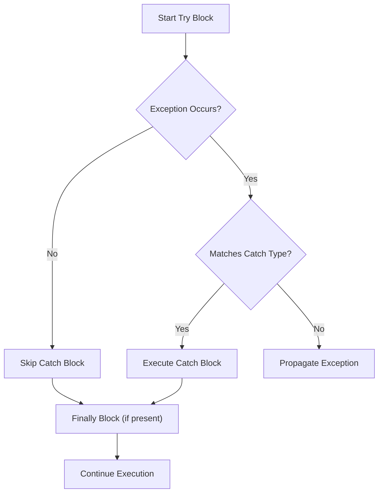

# Java Testing & Exception Handling

**Tags:** #Java #JUnit #Testing #ExceptionHandling #Programming

---

## Part 1: Unit Testing (JUnit 5)

### 1. Simple Arithmetic Calculator Example
A basic class demonstrating methods with different return types and potential runtime errors.

```java
public class Calculator {

    public int add(int a, int b) {
        return a + b;
    }

    public int subtract(int a, int b) {
        return a - b;
    }

    public int multiply(int a, int b) {
        return a * b;
    }

    public double divide(double a, double b) {
        if (b == 0) {
            throw new ArithmeticException("Cannot divide by zero");
        }
        return a / b;
    }

    public double power(double a, double b) {
        // Implementation presumed (e.g., Math.pow)
        return Math.pow(a, b); 
    }
}
```

### 2. Writing Test Cases
Using `org.junit.jupiter.api` (JUnit 5).

> [!TIP] Key Assertions
> *   `assertEquals(expected, actual)`: Checks if values match.
> *   `assertThrows(Exception.class, lambda)`: Verifies code throws a specific exception.
> *   `assertEquals(expected, actual, delta)`: Used for floating-point comparisons.

#### Basic Arithmetic Tests
```java
import static org.junit.jupiter.api.Assertions.*;
import org.junit.jupiter.api.Test;

public class CalculatorTest {

    Calculator calc = new Calculator();

    @Test
    void testAdd() {
        assertEquals(5, calc.add(2, 3));
    }

    @Test
    void testSubtract() {
        assertEquals(6, calc.subtract(10, 4));
    }

    @Test
    void testMultiply() {
        assertEquals(21, calc.multiply(3, 7));
    }
    
    @Test
    void testDivide() {
        assertEquals(4.0, calc.divide(12, 3));
    }
}
```

#### Advanced Scenarios (Exceptions & Precision)

```java
@Test
void testDivideByZero() {
    // format: assertThrows(ExceptionType.class, () -> executable code)
    assertThrows(ArithmeticException.class, () -> calc.divide(5, 0));
}

@Test
void testPower() {
    assertEquals(8.0, calc.power(2, 3));
}

@Test
void testNegativeNumbers() {
    assertEquals(-2, calc.add(-5, 3));
    assertEquals(-15, calc.multiply(-5, 3));
}

@Test
void testFloatingPointPrecision() {
    // 1e-9 is the delta (tolerance) for double comparison
    assertEquals(0.3, calc.add(0.1, 0.2), 1e-9);
}
```

---

## Part 2: Complex Object Testing (Pizza Shop)

### 1. The Class Structure
An example using inheritance and interface implementation.

```java
public class PizzaShop extends Shop implements Nameable {
    
    String companyName;
    String[] foodOfferings = {
        "Pizza", "Spaghetti", "Garden Salad", "Antipasto", "Calzone"
    };

    public String[] getInventory() {
        return foodOfferings;
    }

    public void buyInventory(String item) {
        // Prints to System.out
        System.out.println("\nYou have just purchased " + item);
    }

    public String getName() {
        return companyName;
    }

    public void setName(String name) {
        companyName = name;
    }
}
```

### 2. Testing Arrays and Console Output

> [!NOTE] Setup Method
> The `@BeforeEach` annotation ensures `setUp()` runs before **every** individual test method, resetting the state.

```java
class PizzaShopTest {

    private PizzaShop shop;

    @BeforeEach
    void setUp() {
        shop = new PizzaShop();
    }

    @Test
    void testGetInventory() {
        String[] expected = {
            "Pizza", "Spaghetti", "Garden Salad", "Antipasto", "Calzone"
        };
        // Use assertArrayEquals for arrays, not assertEquals
        assertArrayEquals(expected, shop.getInventory());
    }

    @Test
    void testSetNameAndGetName() {
        shop.setName("Mario's Pizza");
        assertEquals("Mario's Pizza", shop.getName());
    }
}
```

#### 📸 Capturing System Output
Testing methods that return `void` but print to the console requires redirecting `System.out`.

```java
@Test
void testBuyInventoryPrintsMessage() {
    // 1. Capture System.out
    java.io.ByteArrayOutputStream outContent = new java.io.ByteArrayOutputStream();
    System.setOut(new java.io.PrintStream(outContent));

    // 2. Perform Action
    shop.buyInventory("Pizza");

    // 3. Convert captured output to string and verify
    String output = outContent.toString().trim();
    assertTrue(output.contains("You have just purchased Pizza"));
}
```

---

## Part 3: Exception Handling

### Logic Flow


### 1. Basic Try-Catch
Handling a division by zero.
```java
try {
    int x = 10 / 0; // Causes ArithmeticException
} catch (ArithmeticException e) {
    System.out.println("Cannot divide by zero!");
}
```

### 2. Try-Catch-Finally
The `finally` block **always** executes, regardless of success or failure.
```java
try {
    String name = null;
    System.out.println(name.length()); // Causes NullPointerException
} catch (NullPointerException e) {
    System.out.println("Name cannot be null!");
} finally {
    System.out.println("Execution finished.");
}
```

### 3. Handling Multiple Exceptions

#### Approach A: Multiple Catch Blocks
Catches specific exceptions first, then general ones.
```java
try {
    int[] arr = {1, 2, 3};
    System.out.println(arr[5]); // ArrayIndexOutOfBoundsException
} catch (ArrayIndexOutOfBoundsException e) {
    System.out.println("Invalid array index!");
} catch (Exception e) {
    System.out.println("General error occurred.");
}
```

#### Approach B: Multi-Catch (Pipe Syntax)
Catching different exceptions that require the same handling logic.
```java
try {
    int num = Integer.parseInt("abc");
} catch (NumberFormatException | NullPointerException e) {
    System.out.println("Invalid number format!");
}
```

---

## Part 4: Custom & Manual Exceptions

### 1. Throwing Manually
Using the `throw` keyword to enforce logic constraints.
```java
public void setAge(int age) {
    if (age < 0) {
        throw new IllegalArgumentException("Age cannot be negative!");
    }
}
```

### 2. Creating Custom Exceptions
Extending the `Exception` class creates a Checked Exception.

```java
class InvalidPizzaOrderException extends Exception {
    public InvalidPizzaOrderException(String message) {
        super(message);
    }
}
```

### 3. Usage: Throwing vs Catching

**Throwing it (Method Declaration):**
```java
void orderPizza(int quantity) throws InvalidPizzaOrderException {
    if (quantity <= 0) {
        throw new InvalidPizzaOrderException("Quantity must be positive!");
    }
}
```

**Catching it (Implementation):**
```java
try {
    orderPizza(0);
} catch (InvalidPizzaOrderException e) {
    System.out.println(e.getMessage());
}
```