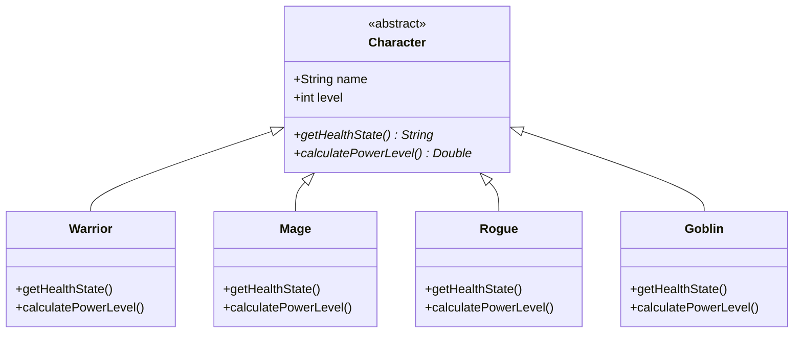

***

# IUT SWE 4301: Object Oriented Concepts II - Mid Semester Exam Solution

**Semester:** Winter 2023-2024
**Course:** SWE 4301 (Object Oriented Concepts II)
**Duration:** 1 Hour 30 Minutes
**Full Marks:** 75

---

## Question 1: Clean Code & TDD

### a) Define clean code and explain why the code in Code Snippet 1 would be considered a costly code to write.

**Definition of Clean Code:**
Clean code is code that is easy to understand, easy to change, and clearly expresses the intent of the author. It follows standard conventions, is self-documenting, and minimizes dependencies. As famously stated by Bjarne Stroustrup, "I like my code to be elegant and efficient... Clean code does one thing well."

**Why Snippet 1 is Costly:**
The provided `StairCase` class is considered costly due to poor **Space Complexity** and **Eager Evaluation**:

1.  **Memory Waste (High Space Complexity):** The code stores every single formatted step string in a `List<String>`. If `n` is 1,000,000, the program allocates memory for 2,000,000 string objects. A clean solution would generate the string on the fly during printing (lazy evaluation), requiring $O(1)$ space instead of $O(n)$.
2.  **Unnecessary Processing (Eager Execution):** The `initializeSteps()` method runs immediately inside the constructor. Even if the user creates the object but decides not to print the steps immediately (or ever), the CPU time to format strings and memory to store them is consumed.
3.  **Violation of SRP (Single Responsibility Principle):** The class handles data generation, storage, and formatting logic. If the formatting requirement changes (e.g., "Step #1" instead of "Step 1"), the logic inside the loop must change, which is tightly coupled with the storage mechanism.

### b) Explain how you would follow Test-Driven Development (TDD) to implement `MinStack` with at least three test cases.

**TDD Process:**
TDD follows the "Red-Green-Refactor" cycle:
1.  **Red:** Write a failing test case that describes the desired behavior.
2.  **Green:** Write the minimal amount of code required to pass that test.
3.  **Refactor:** Clean up the code while ensuring tests still pass.

**Proposed Test Cases for `MinStack`:**

1.  **Test Case 1: Basic Push and Pop**
    *   *Intent:* Ensure the stack behaves like a LIFO structure.
    *   *Action:* `stack.push(5); int val = stack.pop();`
    *   *Assertion:* Assert that `val` equals 5.

2.  **Test Case 2: Retrieve Minimum (Simple)**
    *   *Intent:* Ensure `getMin()` returns the smallest element.
    *   *Action:* `stack.push(5); stack.push(3); stack.push(7);`
    *   *Assertion:* Assert that `stack.getMin()` equals 3.

3.  **Test Case 3: Retrieve Minimum after Pop**
    *   *Intent:* Ensure the minimum updates correctly when the current minimum is popped.
    *   *Action:* `stack.push(3); stack.push(2); stack.pop();`
    *   *Assertion:* Assert that `stack.getMin()` returns to 3 (the previous minimum).

### c) "Technical debt is not just bad code." — Do you agree with this statement? Justify your answer with example.

**Answer:**
**I agree.**

**Justification:**
"Bad code" is often just a mess resulting from incompetence or laziness (reckless debt). **Technical Debt**, in its true metaphorical sense, also encompasses **prudent/deliberate debt**. This occurs when a team makes a conscious decision to choose a quicker, non-optimal solution now to meet a critical deadline (shipping functionality), with the full intention of refactoring it later.

**Example:**
Imagine a startup needs to launch a feature for a Black Friday sale.
*   *Ideally:* They should build a dynamic configuration system in the database to toggle the sale.
*   *The Debt:* To save 3 days of development, they hardcode the sale dates and logic directly into the Java source code.
*   *Result:* The code is clean and works, but it incurs debt because changing the date requires a code deployment rather than a database update. This is a strategic trade-off, not necessarily "bad code," but it is technical debt that must be "repaid" later to restore flexibility.

---

## Question 2: Code Smells, Principles, and Refactoring

### a) Answer the following questions based on Code Snippet 2:

#### i. Identify the code smells and mention the line numbers.

1.  **Switch Statements (Switch on Type):**
    *   *Location:* `RPGCalculator.java` lines **20-29** (`healthState` method) and lines **32-40** (`calculatePowerLevel` method).
    *   *Description:* The code switches on the string `characterClass`. Every time a new class is added, these switches must be modified.
2.  **Feature Envy:**
    *   *Location:* Inside `RPGCalculator` methods.
    *   *Description:* The methods in `RPGCalculator` are more interested in the data of the `Character` class (`stamina`, `magicalPower`, `level`, `exh`) than its own data. This logic belongs inside the `Character` class.
3.  **Magic Numbers:**
    *   *Location:* Lines **22** (`50`), **24** (`75`), **26** (`40`), **34** (`10.0`), **36** (`8.0`, `1.5`), **38** (`7.0`, `1.2`).
    *   *Description:* These literal numbers appear without explanation. They should be named constants (e.g., `WARRIOR_BASE_MULTIPLIER`).

#### ii. Identify the design principles violated and explain how.

1.  **Open/Closed Principle (OCP):**
    *   The `RPGCalculator` class is **not closed for modification**. If we want to add a new character (e.g., "Goblin"), we must modify the source code of the calculator class to add new `case` statements.
2.  **Single Responsibility Principle (SRP):**
    *   The `RPGCalculator` handles business logic for Warriors, Mages, and Rogues simultaneously. It changes for multiple reasons (if Warrior rules change OR if Mage rules change).

#### iii. Implement the extended feature for "Goblin".

*(Note: The question asks to implement the feature in Snippet 2, meaning we extend the existing "bad" code structure as requested by the client constraints before refactoring).*

**Modifications required in `RPGCalculator` class:**

```java
// Inside private String healthState(Character character) switch block:
case "Goblin":
    if (character.stamina > 30) return "sneaky";
    return "weak";

// Inside private Double calculatePowerLevel(Character character) switch block:
case "Goblin":
    double goblinPower = character.level * 5.0 + character.stamina * 0.8;
    return goblinPower + (character.exh ? 0.0 : 10.0);
```

#### iv. Refactor Snippet 2 (Class Diagram / Code Outline).

To fix the OCP and Switch Statement violations, we should use **Polymorphism**.

**Code Outline / Structure:**



**Refactored Logic Outline:**
Instead of an `RPGCalculator`, the logic moves to the specific classes.
*   `Warrior.calculatePowerLevel()`: `return this.level * 10.0 + this.stamina;`
*   `Mage.calculatePowerLevel()`: `return this.level * 8.0 + this.magicalPower * 1.5;`

### b) How would you know whether you have refactored it in a right way?

**Answer:**
**Regression Testing.**
Refactoring is defined as changing the internal structure of code without changing its external behavior. To ensure the refactoring was successful:
1.  **Run Existing Tests:** Before refactoring, ensure a comprehensive test suite (Unit Tests) passes.
2.  **Refactor:** Perform the code changes.
3.  **Run Tests Again:** If the tests still pass (Green), the external behavior is preserved, and the refactoring is safe. If they fail, the behavior was accidentally altered.

---

## Question 3: SOLID Principles & Dependency Injection

### a) Explain the relation between Liskov Substitution Principle (LSP) and Dependency Inversion Principle (DIP), and give a code example where both are violated.

**Relation:**
LSP ensures that subclasses can be substituted for their base classes without altering the correctness of the program. DIP states that high-level modules should depend on abstractions, not details.
If a subclass violates LSP (e.g., by throwing an unexpected exception), the client (High-Level Module) is often forced to add checks (e.g., `if (obj instanceof BadSubClass)`). This explicitly violates DIP because the High-Level Module now depends on the specific detail (the `BadSubClass`) rather than just the abstraction.

**Example of Violation:**

```java
// Abstraction
class Bird {
    void fly() { /* logic to fly */ }
}

class Ostrich extends Bird {
    @Override
    void fly() {
        // LSP Violation: Ostrich cannot fly, breaks parent contract
        throw new UnsupportedOperationException("I can't fly!");
    }
}

class BirdWatcher {
    // DIP Violation: To handle Ostrich, we might have to check concrete types
    // instead of relying on the 'Bird' abstraction.
    void watch(Bird b) {
        if (b instanceof Ostrich) {
            System.out.println("Watching it run...");
        } else {
            b.fly();
        }
    }
}
```

### b) Answer based on Snippet 3 & 4:

#### i. Identify how the current implementation of `NotificationService` violates the Dependency Inversion Principle (DIP).

**Violation:**
In `Snippet 4`, the `NotificationService` class (High-Level Module) is tightly coupled to concrete implementations (`EmailSender`, `SMSSender`, `Logger`).
Specifically, in the **constructor (lines 6-8)**, the class directly creates instances using the `new` keyword:
*   `this.emailSender = new EmailSender();`
*   `this.smsSender = new SMSSender();`

This prevents the class from working with other implementations (e.g., a `MockEmailSender` for testing) or extended versions without modifying the `NotificationService` code.

#### ii. Implement the DIP with dependency injection in Code Snippet 3.

To apply DIP, we introduce interfaces (Abstractions) and inject the dependencies via the constructor.

**Refactored Code:**

```java
// 1. Define Abstractions
interface MessageSender {
    void send(String message);
    String getChannelType(); // Helper to identify channel
}

interface ILogger {
    void log(String message);
}

// 2. Concrete Implementations
class EmailSender implements MessageSender {
    public void send(String message) {
        System.out.println("Sending email: " + message);
    }
    public String getChannelType() { return "email"; }
}

class SMSSender implements MessageSender {
    public void send(String message) {
        System.out.println("Sending SMS: " + message);
    }
    public String getChannelType() { return "sms"; }
}

class Logger implements ILogger {
    public void log(String message) {
        System.out.println("Logging: " + message);
    }
}

// 3. High-Level Module with Dependency Injection
class NotificationService {
    private Map<String, MessageSender> senders;
    private ILogger logger;

    // Constructor Injection: Dependencies are passed in, not created inside
    public NotificationService(List<MessageSender> senderList, ILogger logger) {
        this.logger = logger;
        this.senders = new HashMap<>();
        // Map channels to senders for O(1) lookup
        for (MessageSender sender : senderList) {
            this.senders.put(sender.getChannelType(), sender);
        }
    }

    public void sendNotification(String message, List<String> channels) {
        for (String channel : channels) {
            MessageSender sender = senders.get(channel);
            if (sender != null) {
                sender.send(message);
            } else {
                System.out.println("Unsupported channel: " + channel);
            }
        }
        logger.log("Notification sent via " + channels + ": " + message);
    }
}
```