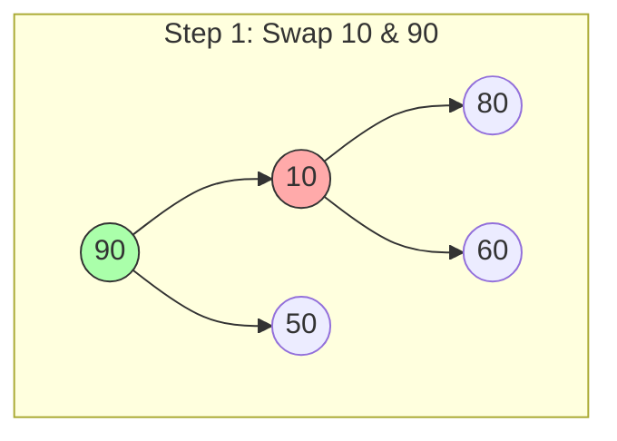
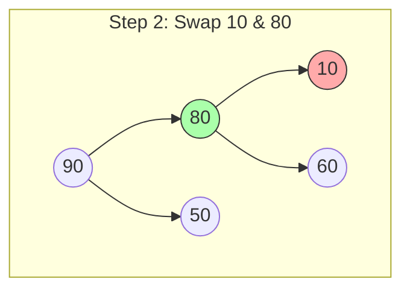
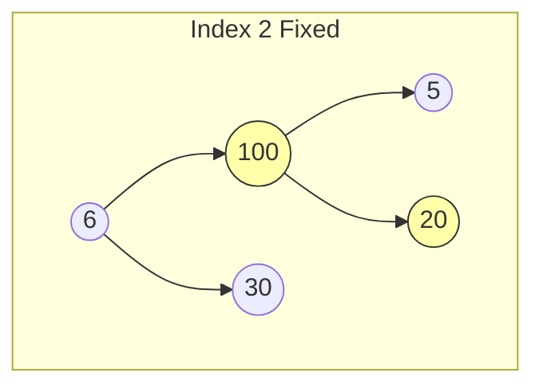
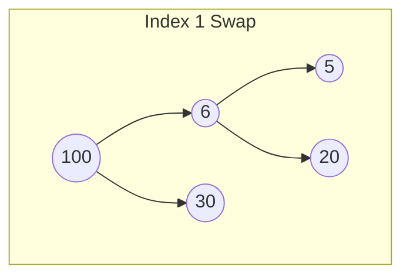
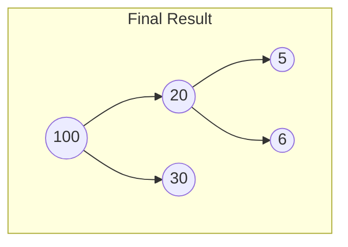
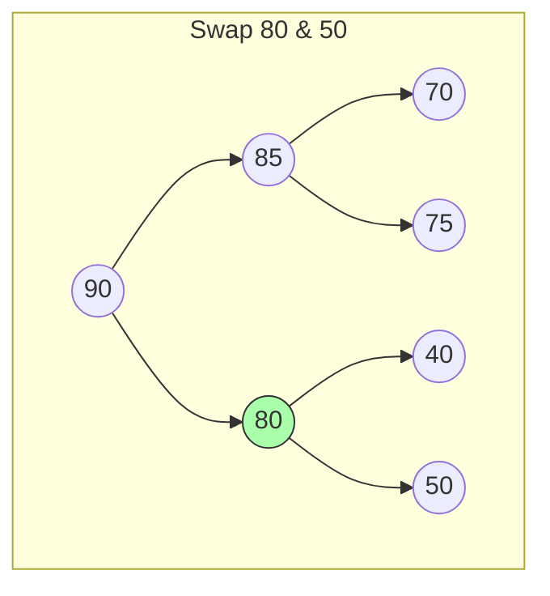
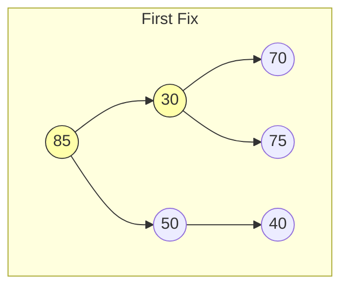
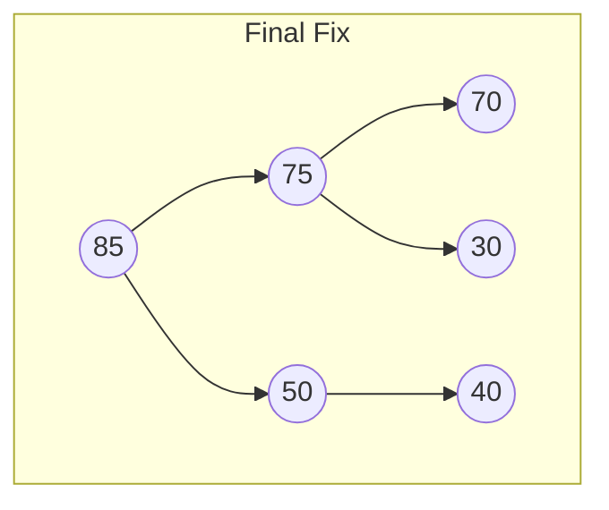

tags: [DataStructures, Algorithms, Heaps, PriorityQueue, CSE4303, LectureNotes]
course: CSE 4303 - Data Structures
lecture: 9
topic: Binary Heap
lecturer: Asaduzzaman Herok
date: 2026-01-22
reference: Data Structures Using C (2nd Edition), Reema Thareja - Chapter 12
---
# Binary Heap

## 1. Recap: The Need for a Better Priority Queue

### What is a Priority Queue?
An abstract data type where every element has a **priority**.
*   **Rule:** Elements with higher priority are served before elements with lower priority (e.g., CPU scheduling).
*   **Key Operations:** `insert(item)` and `extract_max()` (or `extract_min()`).

### The Problem with Naive Implementations
If we implement a Priority Queue using simple Arrays or Linked Lists, we hit a performance bottleneck.

| Approach | Insert | Extract Max | Verdict |
| :--- | :--- | :--- | :--- |
| **Unsorted Array** | $O(1)$ | $O(N)$ | Too slow to find the max (Linear Scan). |
| **Sorted Array** | $O(N)$ | $O(1)$ | Too slow to add (Shifting elements). |
| **Binary Heap** | $O(\log N)$ | $O(\log N)$ | **Balances both efficiently.** |

> [!summary] Conclusion
> Arrays are either too slow to insert or too slow to search. We need a structure that balances both operations. Enter the **Binary Heap**.

---

## 2. What is a Binary Heap?

A Binary Heap is a binary tree with two specific constraints:

### A. Heap Property (Max-Heap)
For every node $i$, the value of the parent is greater than or equal to the values of its children.
$$ \text{Parent}(i) \ge \text{Children}(i) $$ 
*   **Result:** The largest element is *always* at the root.

### B. Shape Property
It must be a **Complete Binary Tree**.
1.  All levels are fully filled, except possibly the last.
2.  Nodes are filled from **left to right**. (Why? So in their array representation, they are filled sequentially.)

---

## 3. Implementation: Array vs. Linked List

### Option 1: Linked Nodes
*   Uses pointers: `left`, `right`, `parent`.
*   **The Problem:** Heaps must remain *Complete*. Finding the next free spot (bottom-left-most available leaf) requires a Level Order Traversal ($O(N)$) or complex tracking.
*   **Verdict:** Inefficient for Heaps.

### Option 2: Array (The Standard)
*   Stores nodes in **Level Order**.
*   No pointers needed (**Implicit structure**).
*   **The Advantage:** The next free spot is always at `index = size`.
*   **Verdict:** $O(1)$ access to the insertion point.

### Mapping Levels to Indices (0-based vs 1-based)
*Although the slides mention 0-based in the title, the visual diagrams and formulas use **1-based indexing**. The notes below follow the 1-based convention shown in the slide formulas.*

**Formulas for Node $i$:**
*   **Left Child:** $2 \times i$
*   **Right Child:** $(2 \times i) + 1$
*   **Parent:** $\lfloor \frac{i}{2} \rfloor$

**Visual Map (Array Representation):**
Tree: Root(90) $\to$ Left(85), Right(80)...
Array: `[Empty, 90, 85, 80, 75, 72, 74, 78, 70, 65, 50, 62, 40, 55]`

> [!TIP] Optimization Insight: The Leaf Node Property
> In a heap of size $N$, we can instantly calculate where the leaves start.
> *   **Internal Nodes:** Indices $1$ to $\lfloor N/2 \rfloor$.
> *   **Leaf Nodes:** Indices $\lfloor N/2 \rfloor + 1$ to $N$.
>
> *Example (N=13):*
> *   Indices 1 to 6 are Internal nodes.
> *   Indices 7 to 13 are Leaf nodes.

---

## 4. Fixing a Violation: Heapify Down

### The Scenario
A node (Parent) violates the Max-Heap property because it is **smaller** than one or both of its children.
*   **The Fix (Percolate Down):** We must "demote" the node down the tree until it finds its correct spot.

### The "Swap with Largest" Rule
To maintain the structure, you must swap the parent with the **LARGEST** of its two children.
1.  Compare $A[i]$, $A[Left]$, and $A[Right]$.
2.  If $A[i]$ is largest $\to$ Done.
3.  Else $\to$ Swap $A[i]$ with the largest child and repeat.

> [!WARNING] Why specifically the largest?
> If we swapped with the smaller child, the larger child would remain below, and since it is larger than the original parent, it would still violate the property with the swapped node.

### Detailed Visual Example: The Cascade Effect
**Initial State:** Root is 10. Children are 90 and 50. (Violation: $10 < 90$). 

**Step 1:** Compare 10, 90, 50. Largest is 90. **Swap 10 $\leftrightarrow$ 90.**


**Step 2:** New position of 10. Children are 80 and 60. (Violation: $10 < 80$).
Largest is 80. **Swap 10 $\leftrightarrow$ 80.**

*Result:* Node 10 is now a leaf. No more violations. Time Complexity: $O(\log N)$.

### Pseudocode: `max_heapify(i)`
```cpp
l = 2 * i;
r = 2 * i + 1;
// Find largest among Root, Left, and Right
if (l <= heapSize && heap[l] > heap[i])
    largest = l;
else
    largest = i;

if (r <= heapSize && heap[r] > heap[largest])
    largest = r;

// If root is not largest, swap and recurse
if (largest != i) {
    exchange heap[i] <-> heap[largest];
    max_heapify(largest);
}
```

---

## 5. Building a Heap

### Why Top-Down Build Fails
**Naive Idea:** Iterate from $1 \to N$ calling `max_heapify`.
**Why it fails:** `max_heapify(i)` assumes the subtrees of $i$ are *already* valid heaps. If we start at the root, the bottom is unordered.
*   *Example failure:* Elements `[6, 20, 30, 5, 100]`. If we heapify root `6`, it swaps with `30`. The "Giant" `100` at the bottom never gets checked against `30` or `6`. The algorithm terminates with an invalid heap.

### The Solution: Bottom-Up Build Heap
**Strategy:** Fix the small sub-trees first, then move up.
1.  **Start:** Index $\lfloor N/2 \rfloor$ (The last internal node).
2.  **Direction:** Iterate backwards down to 1.
3.  **Guarantee:** By the time we reach node $i$, we guarantee that `left(i)` and `right(i)` are already valid heaps.

**Pseudocode:**
```cpp
for i = heapSize / 2 down to 1:
    max_heapify(heap, i, heapSize)
```

### Visual Walkthrough: Bottom-Up Build
**Array:** `[6, 20, 30, 5, 100]`
**Internal Nodes:** Indices 1 (Val 6) and 2 (Val 20). Start at 2.

**Step 1: Fix Index 2 (Val 20)**
*   Children: 5, 100.
*   Swap 20 with 100.


**Step 2: Fix Index 1 (Val 6)**
*   Children: 100, 30.
*   Swap 6 with 100.


**Step 3: Cascade Fix on New Index 2 (Val 6)**
*   Node 6 moved down. Children: 5, 20.
*   Swap 6 with 20.

**Result:** The "Giant" (100) successfully moved from bottom leaf to Root.

---

## 6. Analysis: Build Heap Complexity

### The Naive Analysis ($O(N \log N)$)
*   We call `max_heapify` for $N/2$ nodes.
*   Each call takes $O(\log N)$.
*   Total $\approx O(N \log N)$. *(Upper bound, but not tight!)*

### The Better Analysis ($O(N)$)
`max_heapify` takes time proportional to the **height** of the node, not always $\log N$.
*   **Leaves (50% of nodes):** Height 0. Work = 0.
*   **Next Level (25% of nodes):** Height 1. Work = 1 step.
*   **Only the Root (1 node):** Height $\log N$.

**Mathematical Proof:**
Total Work $S = \text{Sum of work for all nodes}$.
Nodes at height $h$ require $O(h)$ work (swaps).
The number of nodes at height $h$ is at most $\lceil \frac{N}{2^{h+1}} \rceil$.

$$ S = \sum_{h=0}^{\lfloor \lg N \rfloor} \frac{N}{2^{h+1}} \cdot h = \frac{N}{2} \sum_{h=0}^{\lfloor \lg N \rfloor} \frac{h}{2^h} $$

Let's solve the infinite series part $S_{AG} = \sum_{h=0}^{\infty} \frac{h}{2^h}$.
$$ \begin{aligned}
S_{AG} &= \frac{0}{2^0} + \frac{1}{2^1} + \frac{2}{2^2} + \frac{3}{2^3} + \dots \\
S_{AG} &= 0 + \frac{1}{2} + \frac{2}{4} + \frac{3}{8} + \dots \quad \text{(Equation 1)}
\end{aligned} $$

Multiply Equation 1 by 2:
$$ \begin{aligned}
2 \cdot S_{AG} &= 2 \left( \frac{1}{2} + \frac{2}{4} + \frac{3}{8} + \dots \right) \\
2 \cdot S_{AG} &= 1 + \frac{2}{2} + \frac{3}{4} + \dots \quad \text{(Equation 2)}
\end{aligned} $$

Subtract Equation 1 from Equation 2:
$$ \begin{aligned}
2 S_{AG} - S_{AG} &= 1 + \left( \frac{2}{2} - \frac{1}{2} \right) + \left( \frac{3}{4} - \frac{2}{4} \right) + \dots \\
S_{AG} &= 1 + \frac{1}{2} + \frac{1}{4} + \dots
\end{aligned} $$

This is a Geometric Series with $a=1, r=1/2$. Sum $= \frac{a}{1-r}$:
$$ S_{AG} = \frac{1}{1 - 0.5} = 2 $$

Substituting back into total work:
$$ S = \frac{N}{2} \cdot S_{AG} = \frac{N}{2} \cdot 2 = N $$

$$ S = O(N) $$ 

> [!SUCCESS] Verdict
> Building a heap from an unordered array takes **Linear Time $O(N)$**.

---

## 7. Insertion (Percolate Up)

### Algorithm
1.  **Shape First:** Insert the new key at the end of the array (next available leaf).
    *   `parent_index = current_index / 2`
2.  **Order Second:** Compare the new key with its Parent.
3.  **Swap:** If Child > Parent, swap. Repeat until heap property is restored.
    *   *"The new guy has to earn his way to the top."*

### Visual Walkthrough
**Initial Heap:** `90, 85, 50, 70, 75, 40` (Size 6).
**Task:** Insert `80`.

**Step 1:** Insert at end (Index 7). Parent is Index 3 (Val 50).
**Step 2:** Compare 80 vs 50. $80 > 50$. **Swap.**

**Step 3:** Current Index 3. Parent is Index 1 (Val 90).
**Step 4:** Compare 80 vs 90. $80 < 90$. **Stop.**

### Complexity
*   Time: $O(\log N)$ (Height of tree).
*   Space: $O(1)$.

---

## 8. Extract Max (Delete Root)

### The Challenge
Removing the root leaves two disconnected sub-trees. We must preserve the Shape Property.

### Algorithm ($O(\log N)$)
1.  **Swap:** Exchange the Root with the **Last Leaf** (last index).
2.  **Remove:** Decrement `heap_size` (effectively removing the Max).
3.  **Fix:** The new Root is likely small. Call `max_heapify(1)` (Bubble Down).

### Visual Walkthrough
**Heap:** Root `90`, Last Leaf `30`.

**Step 1 (Swap & Remove):** 30 becomes Root. 90 is removed.
**Step 2 (Violation):** Root 30 is smaller than children 85 and 50.
*   Swap 30 with 85 (Largest Child).

**Step 3 (Cascade):** 30 is at Index 2. Children 70 and 75.
*   Swap 30 with 75 (Largest Child).

**Step 4:** 30 is a leaf. **Stop.**

---

## 9. Advanced Operations

### Arbitrary Deletion
Task: Delete a node with value $X$ (not necessarily the root).
1.  **Find the node:** Heaps are weakly ordered. We must scan linearly. **Cost: $O(N)$**.
2.  **Delete at Index $i$:**
    *   Swap $A[i]$ with $A[size]$.
    *   Decrease size.
    *   **Case A:** If new $A[i] > Parent 	o$ **Percolate Up**.
    *   **Case B:** Else $	o$ **max_heapify(i)** (Down).
    *   **Cost:** $O(\log N)$.

### Modifying Keys
1.  **Increase Key (Value goes UP):**
    *   Node becomes larger than children (Safe).
    *   Might be larger than Parent.
    *   **Action:** Update value, then **Percolate Up**.
2.  **Decrease Key (Value goes DOWN):**
    *   Node becomes smaller than Parent (Safe).
    *   Might be smaller than Children.
    *   **Action:** Update value, then **Heapify Down**.

---

## 10. Application: Heap Sort

**Idea:** If we can extract the maximum element in $O(\log N)$, do it $N-1$ times to get it sorted.

### Algorithm
1.  **Build Max Heap** from unordered array. ($O(N)$)
2.  **Loop** $i$ from $N$ down to 2: ($O(N \log N)$)
    *   Swap Root ($A[1]$) with Last ($A[i]$).
    *   *The largest element is now "sorted" at the end.*
    *   Reduce heap size by 1.
    *   Call `max_heapify(1)` to fix the root.

### Complexity
*   **Time:** $O(N \log N)$ (Best, Average, and Worst case).
*   **Space:** $O(1)$ (In-place sorting).

---

## 11. Summary: Priority Queue Implementation

A Binary Heap is the standard implementation for a Priority Queue.

| PQ Operation | Heap Equivalent | Complexity | Details |
| :--- | :--- | :--- | :--- |
| `peek_max()` | Return `A[1]` | $O(1)$ | Root is always max. |
| `insert(k)` | 1. Add to end `A[++size]`<br>2. Percolate Up | $O(\log N)$ | Path to root. |
| `extract_max()` | 1. Swap Root $\leftrightarrow$ Last<br>2. `size--`<br>3. `max_heapify(1)` | $O(\log N)$ | Path to leaf. |

> [!NOTE] Min-Heaps
> All logic is identical for Min-Heaps, but inequalities are reversed ($Parent \le Child$). 

---

## 12. C++ Implementation

This implementation follows the logic from the slides.

_Note: The slides use **1-based indexing**. The code below uses standard C++ **0-based indexing**, so the formulas are slightly adjusted (Left = $2i+1$, Right = $2i+2$, Parent = $(i-1)/2$)._

```cpp
#include <iostream>
#include <vector>
#include <cmath>
#include <algorithm> // For swap

using namespace std;

class MaxHeap {
private:
    vector<int> heap;

    // Helper: Get Parent Index (0-based)
    int parent(int i) { return (i - 1) / 2; }

    // Helper: Get Left Child Index (0-based)
    int left(int i) { return (2 * i) + 1; }

    // Helper: Get Right Child Index (0-based)
    int right(int i) { return (2 * i) + 2; }

    // Core Logic: Heapify Down (Fix violations downwards)
    // Time: O(log N)
    void max_heapify(int i, int n) {
        int l = left(i);
        int r = right(i);
        int largest = i;

        // Compare with Left Child
        if (l < n && heap[l] > heap[largest]) {
            largest = l;
        }
        // Compare with Right Child
        if (r < n && heap[r] > heap[largest]) {
            largest = r;
        }

        // If violation exists (Parent is not the largest)
        if (largest != i) {
            swap(heap[i], heap[largest]); // Swap parent with largest child
            max_heapify(largest, n);      // Recursively fix the affected sub-tree
        }
    }

public:
    // Constructor
    MaxHeap() {}

    // Build Heap from an arbitrary vector
    // Time: O(N) [cite: 430]
    void buildHeap(const vector<int>& input) {
        heap = input;
        int n = heap.size();
        // Start from the last internal node and go up to the root
        // Last internal node formula (0-based): (n/2) - 1
        for (int i = (n / 2) - 1; i >= 0; i--) {
            max_heapify(i, n);
        }
    }

    // Insert a new key
    // Time: O(log N) [cite: 445]
    void insert(int key) {
        heap.push_back(key); // 1. Shape First: Insert at end
        
        // 2. Order Second: Percolate Up
        int i = heap.size() - 1;
        while (i != 0 && heap[parent(i)] < heap[i]) {
            swap(heap[i], heap[parent(i)]);
            i = parent(i);
        }
    }

    // Extract Max (Remove Root)
    // Time: O(log N) [cite: 479]
    int extractMax() {
        if (heap.size() == 0) return -1; // Error

        int maxVal = heap[0];
        
        // 1. Swap Root with Last Leaf
        heap[0] = heap.back();
        
        // 2. Remove Last
        heap.pop_back();

        // 3. Fix the Root (Heapify Down)
        max_heapify(0, heap.size());

        return maxVal;
    }

    // Heap Sort
    // Time: O(N log N) 
    static void heapSort(vector<int>& arr) {
        MaxHeap tempHeap;
        tempHeap.buildHeap(arr); // Step 1: Build Heap (O(N))

        int n = arr.size();
        
        // Use the internal heapify logic to sort in-place
        // Note: For strict in-place sort, we would operate directly on 'arr'
        // This demonstrates the logic described in slide 27
        for (int i = n - 1; i > 0; i--) {
            // Swap root (max) with end
            swap(tempHeap.heap[0], tempHeap.heap[i]);
            
            // "Remove" element by reducing the scope of heapify to i
            tempHeap.max_heapify(0, i);
        }
        arr = tempHeap.heap;
    }

    void print() {
        for (int val : heap) cout << val << " ";
        cout << endl;
    }
};

int main() {
    MaxHeap h;
    
    // Test Build Heap
    vector<int> data = {10, 20, 15, 30, 40};
    cout << "Input Array: ";
    for(int i : data) cout << i << " ";
    cout << endl;

    h.buildHeap(data);
    cout << "After Build Heap: ";
    h.print(); // Expected Root: 40

    // Test Insert
    cout << "Inserting 50..." << endl;
    h.insert(50);
    cout << "Heap: ";
    h.print(); // Expected Root: 50

    // Test Extract Max
    cout << "Extracted Max: " << h.extractMax() << endl; // Should be 50
    cout << "Heap after extraction: ";
    h.print();

    return 0;
}
```