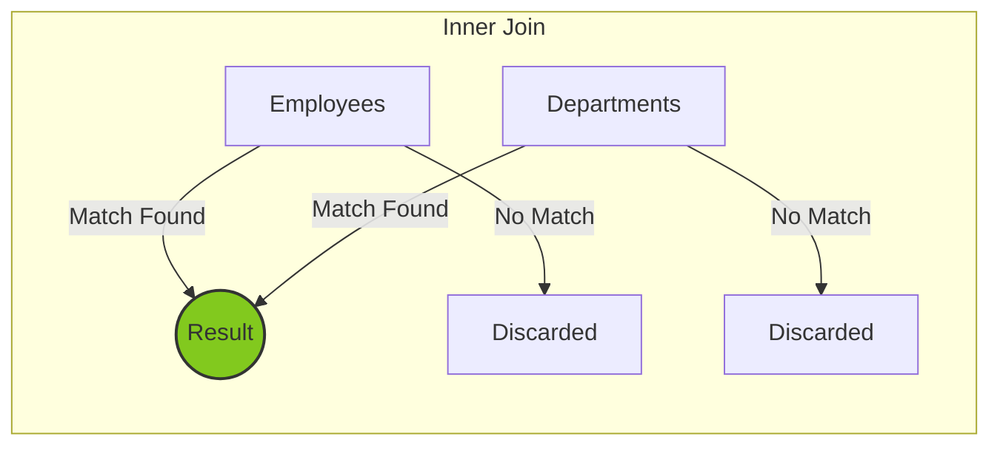
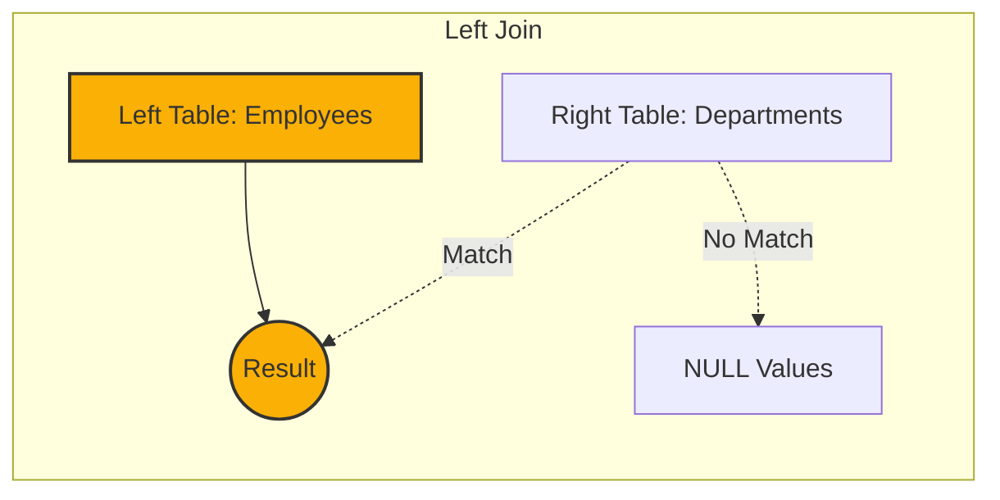
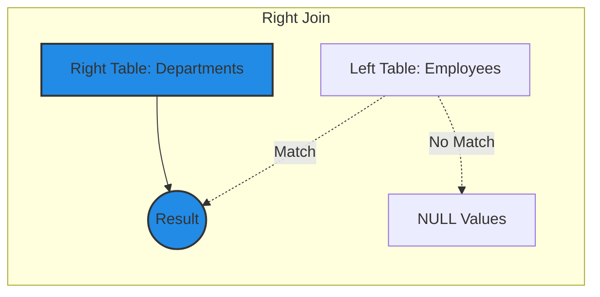
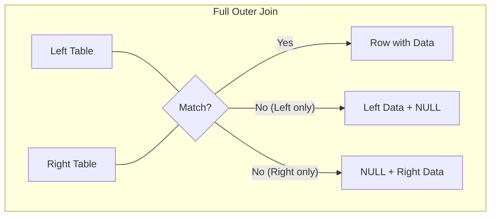
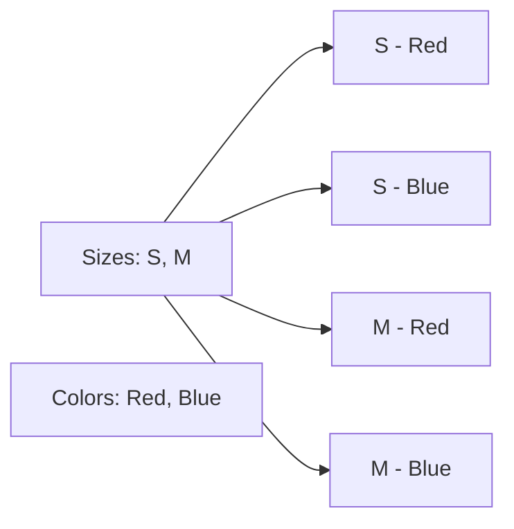

**Tags:** #postgresql #sql #database #backend #learning
**Based on:** [[Neon.tech Tutorials]]

---

## 1. Setup: Example Data
To understand these joins, assume the following two tables exist in the database.

**Table: `employees`**

| id  | name    | dept_id |
| :-- | :------ | :------ |
| 1   | Alice   | 10      |
| 2   | Bob     | 20      |
| 3   | Charlie | NULL    |

**Table: `departments`**

| dept_id | dept_name |
| :------ | :-------- |
| 10      | Sales     |
| 20      | HR        |
| 30      | IT        |

---

## 2. Inner Join
The **Inner Join** is the default join type. It returns rows only when there is a match in **both** tables. If a row in the left table does not have a matching key in the right table (or vice versa), it is excluded.

> [!INFO] Mental Model
> **Intersection**: Only the overlapping area of two circles.

### Visual


### Syntax
```sql
SELECT columns
FROM table1
INNER JOIN table2
ON table1.column = table2.column;
```

### Example
Find employees assigned to a valid department.

```sql
SELECT e.name, d.dept_name
FROM employees e
INNER JOIN departments d 
ON e.dept_id = d.dept_id;
```

**Result:**

| name  | dept_name |
| :---- | :-------- |
| Alice | Sales     |
| Bob   | HR        |
*(Charlie is excluded because `dept_id` is NULL. IT is excluded because no employee matches.)*

---

## 3. Left Join (Left Outer Join)
The **Left Join** returns **all** rows from the left table (`table1`), and the matching rows from the right table (`table2`). If there is no match, the result is `NULL` on the right side.

> [!TIP] Usage
> Use this when you want to keep everything from the primary table (e.g., "Show me all employees, even if they aren't assigned a department").

### Visual


### Syntax
```sql
SELECT columns
FROM table1
LEFT JOIN table2
ON table1.column = table2.column;
```

### Example
List all employees and their department names (if any).

```sql
SELECT e.name, d.dept_name
FROM employees e
LEFT JOIN departments d 
ON e.dept_id = d.dept_id;
```

**Result:**

| name        | dept_name |
| :---------- | :-------- |
| Alice       | Sales     |
| Bob         | HR        |
| **Charlie** | **NULL**  |

---

## 4. Right Join (Right Outer Join)
The **Right Join** is the reverse of the Left Join. It returns **all** rows from the right table (`table2`), and matching rows from the left table (`table1`).

> [!NOTE] Preference
> In practice, Right Joins are rare. Most developers prefer to just swap the table order and use a Left Join for better readability (reading Left-to-Right).

### Visual


### Syntax
```sql
SELECT columns
FROM table1
RIGHT JOIN table2
ON table1.column = table2.column;
```

### Example
List all departments and the employees in them (if any).

```sql
SELECT e.name, d.dept_name
FROM employees e
RIGHT JOIN departments d 
ON e.dept_id = d.dept_id;
```

**Result:**

| name     | dept_name |
| :------- | :-------- |
| Alice    | Sales     |
| Bob      | HR        |
| **NULL** | **IT**    |

---

## 5. Full Outer Join
The **Full Outer Join** combines the results of both Left and Right joins. It returns **all** rows from both tables, filling in `NULL`s where matches are missing on either side.

> [!SUMMARY] Union
> It preserves all information from both datasets.

### Visual


### Syntax
```sql
SELECT columns
FROM table1
FULL OUTER JOIN table2
ON table1.column = table2.column;
```

### Example
List all employees and all departments, regardless of connections.

```sql
SELECT e.name, d.dept_name
FROM employees e
FULL OUTER JOIN departments d 
ON e.dept_id = d.dept_id;
```

**Result:**

| name    | dept_name |
| :------ | :-------- |
| Alice   | Sales     |
| Bob     | HR        |
| Charlie | NULL      |
| NULL    | IT        |

---

## 6. Cross Join
The **Cross Join** produces a **Cartesian Product**. It combines every row from the first table with every row from the second table.

> [!WARNING] Performance Hazard
> If Table A has 1,000 rows and Table B has 1,000 rows, the result is **1,000,000 rows**. Use with caution.
> Note: There is no `ON` clause.

### Visual


### Syntax
```sql
SELECT columns
FROM table1
CROSS JOIN table2;
```

### Example
Imagine a T-shirt inventory generation.
*Table `sizes`: S, M*
*Table `colors`: Red, Blue*

```sql
SELECT s.size, c.color
FROM sizes s
CROSS JOIN colors c;
```

**Result:**

| size | color |
| :--- | :---- |
| S    | Red   |
| S    | Blue  |
| M    | Red   |
| M    | Blue  |

---

## 7. Self Join
A **Self Join** is a regular join (usually Inner or Left), but a table is joined **to itself**.

> [!IMPORTANT] Aliases Required
> You **must** use table aliases (e.g., `e1` and `e2`) to distinguish the two instances of the same table.

### Use Case
Hierarchical data, such as:
- Employees and Managers (stored in the same table)
- Category and Sub-category

### Example Data: Employees with Managers
| id  | name  | manager_id |
| :-- | :---- | :--------- |
| 1   | Alice | NULL       |
| 2   | Bob   | 1          |
| 3   | Eve   | 1          |

### Syntax & Example
Find the name of every employee and their manager's name.

```sql
SELECT 
    e.name AS employee, 
    m.name AS manager
FROM employees e        -- Instance 1: Acts as "Employee"
LEFT JOIN employees m   -- Instance 2: Acts as "Manager"
ON e.manager_id = m.id;
```

**Result:**

| employee | manager |
| :------- | :------ |
| Alice    | NULL    |
| Bob      | Alice   |
| Eve      | Alice   |

---

## 8. Natural Join
A **Natural Join** automatically creates an implicit join clause based on **columns with the same name** in the two tables.

It can be a `NATURAL LEFT JOIN`, `NATURAL RIGHT JOIN`, or default to `NATURAL INNER JOIN`.

> [!DANGER] Best Practice Warning
> Avoid using Natural Joins in production code. 
> If you add a column like `created_at` or `status` to both tables later, the Natural Join will suddenly try to join on those columns too, breaking your query logic silently.

### Syntax
```sql
SELECT *
FROM table1
NATURAL JOIN table2;
```

### Logic
If `employees` has `dept_id` and `departments` has `dept_id`, PostgreSQL automatically executes:
`... ON employees.dept_id = departments.dept_id`

### Example
```sql
SELECT * 
FROM employees 
NATURAL JOIN departments;
```
*(This produces the same result as the Inner Join example, provided `dept_id` is the only common column name).*
