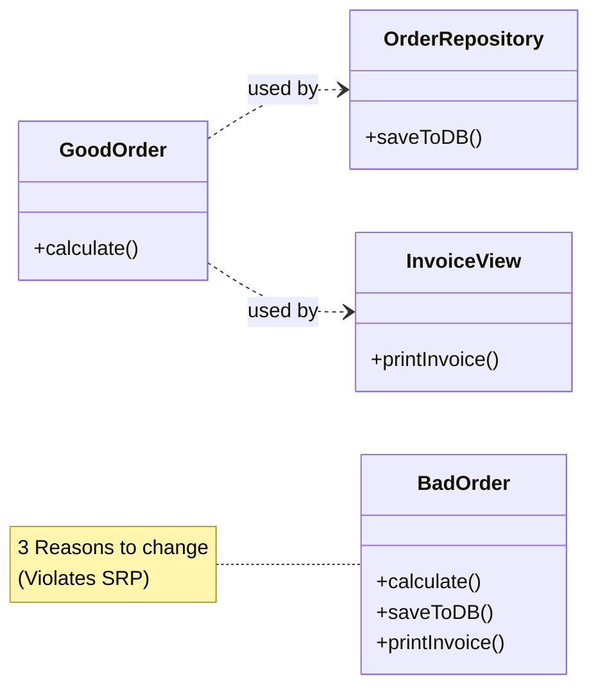

Here is a formatted Markdown file designed specifically for an Obsidian vault. It includes **YAML frontmatter**, **callouts**, **wiki-links**, **syntax highlighting**, and a **Mermaid diagram**.

You can copy and paste the raw code below directly into a new note in Obsidian.

***

---
tags:
  - software-engineering/principles
  - solid
  - clean-code
  - architecture
aliases:
  - SRP
  - Separation of Concerns
created: {{date}}
---

# Single Responsibility Principle (SRP)

> [!quote] Definition
> **"A class should have one, and only one, reason to change."**
> — *Robert C. Martin (Uncle Bob)*

The **Single Responsibility Principle** is the **"S"** in [[SOLID]] design principles. It states that a module, class, or function should be responsible to one, and only one, actor (stakeholder).

## 🧠 Core Concept
Many developers mistake SRP for "doing only one thing." While related, SRP is specifically about **people and change**. 

If a class handles *Business Logic* (requested by the Product Owner) and *Database Persistence* (requested by the DBA/Ops), it has **two reasons to change**.
- **High Cohesion:** Things that change together stay together.
- **Low Coupling:** Things that change for different reasons should be separated.

---

## 🚫 The Violation (Anti-Pattern)
Here, the `Order` class handles calculation (Business rule) and printing (Presentation rule).

```typescript
class Order {
  lineItems: any[];

  // Reason to change: Marketing changes the tax calculation logic
  calculateTotalSum() {
    // ... logic ...
  }

  // Reason to change: Legal wants a different footer on the invoice PDF
  printInvoice() {
    // ... printing logic ...
  }
}
```

> [!failure] Problems
> 1. If we change the print format, we might accidentally break the calculation logic.
> 2. The class depends on both Business Logic libraries and UI/Printing libraries.
> 3. Difficult to test calculation without mocking the printing system.

---

## ✅ The Solution (Refactored)
We separate the concerns into different classes. The `Order` class is now a plain data object or handles only domain rules, while printing is delegated.

```typescript
// Responsibility: Domain / Business Rules
class Order {
  lineItems: any[];

  calculateTotalSum() {
    // ... logic ...
  }
}

// Responsibility: Presentation / Formatting
class InvoicePrinter {
  print(order: Order) {
    // ... printing logic ...
  }
}

// Responsibility: Persistence
class OrderRepository {
    save(order: Order) {
        // ... database logic ...
    }
}
```

### 📊 Visual Representation



---

## 🚩 Signs You Are Violating SRP
1. **The God Object:** A class named `Manager`, `Util`, or `Controller` that is thousands of lines long.
2. **Too Many Imports:** If your class imports UI libraries, SQL drivers, and Math parsers, it's doing too much.
3. **Generic Names:** If you can't name the class specifically (e.g., `UserManager` vs `UserAuthenticator`), it might have too many responsibilities.
4. **"And" in method descriptions:** If a method "Calculates pay **and** updates the database," it breaks SRP.

## 🔗 Related Notes
- [[Open-Closed Principle]] (The 'O' in SOLID)
- [[Separation of Concerns]]
- [[Cohesion vs Coupling]]
- [[Don't Repeat Yourself (DRY)]]

---
## 📚 References
- *Clean Architecture* by Robert C. Martin
- [Refactoring.guru - SRP](https://refactoring.guru/design-patterns/principles)